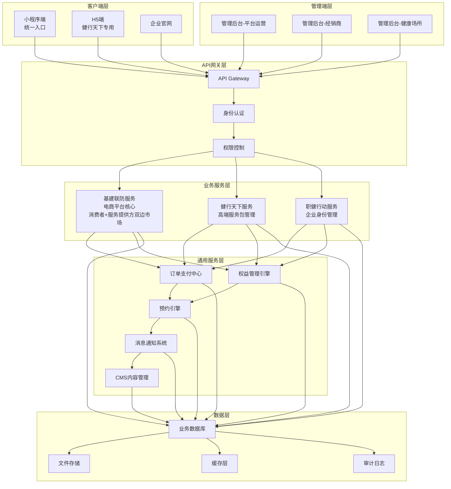

# 陆合铭云健康服务平台设计文档

## 概述

陆合铭云健康服务平台是一个整合"基建联防/健行天下/职健行动"三大业务线的统一数字化平台。本设计文档提供完整的技术架构、组件设计和实现方案，确保系统的可扩展性、安全性和业务正确性。

## 系统形态与边界（端侧系统说明）

本平台由多个端侧系统共同组成，它们通过统一的 API 网关与后端服务交互，并由统一的内容/配置/权限体系支撑。为避免功能重复与口径不一致，本节明确每个系统的**定位、服务对象、核心能力、与其他系统的关系、关键约束**。

### 1）企业官网（品牌展示与对外信息入口）

- **定位**：企业对外的品牌与业务展示站点，承载“可信赖、健康活力”的品牌形象与对外信息传达。
- **服务对象**：潜在客户/合作方/公众访问者。
- **核心能力**：
  - **品牌与业务线介绍**：对外介绍“基建联防 / 健行天下 / 职健行动”与平台能力。
  - **内容展示**：展示平台新闻、公告、服务介绍等内容（内容来源可由后端 CMS/配置提供）。
  - **SEO 与响应式**：面向搜索引擎优化，适配 PC 与移动端。
- **与其他系统关系**：
  - 可引导用户进入小程序或 H5（例如营销落地页、活动入口），但官网本身不承载交易闭环。
- **关键约束**：
  - 以信息展示为主，不承担需要登录后才能完成的核心业务操作（如订单、权益、预约等）。

### 2）管理后台系统（统一运营与多角色管理）

管理后台是平台的“管理与配置中心”，用于管理小程序端、h5端、企业官网所展示的信息与业务配置，并对订单、权益、预约等关键数据进行运营管理。按使用角色划分为三类后台形态（可为同一系统内不同权限/菜单视图）：

#### 2.1 平台运营后台（admin）

- **定位**：平台方运营与风控的主后台。
- **服务对象**：平台运营人员、客服、财务/结算、审核人员等。
- **核心能力（与本设计文档已定义的服务域对应）**：
  - **用户与身份**：用户管理、企业信息库与绑定审核/查询（对应“统一身份认证/企业绑定”能力）。
  - **商品与交易**：商品/服务包配置与上架、订单/支付状态管理、退款规则执行与审核。
  - **权益与核销**：权益生成查询、转赠/退款条件校验、核销记录审计。
  - **预约与履约**：预约规则配置（自动/人工确认）、取消窗口规则、容量释放等。
  - **内容与配置**：CMS 内容、系统配置、消息通知模板等管理。
  - **小程序配置中心**：配置小程序首页运营位/快捷入口，以及可配置页面（聚合页/信息页）的发布与生效；并对服务提供方展示资料进行审核发布（详见下文“可配置页面与内容集合”）。
  - **审计与合规**：关键操作留痕与审计查询。

#### 2.2 经销商后台（dealer）

- **定位**：经销商侧业务与归属的管理后台，围绕“健行天下”链路中的经销商参数与归属管理展开。
- **服务对象**：经销商运营人员。
- **核心能力**：
  - **经销商信息与层级**：经销商基础信息、层级关系维护（文档中已列出相关数据表）。
  - **链接/参数管理**：生成与管理携带经销商参数的 H5 链接，并配合后端完成参数解析与防篡改校验（对应正确性属性 5）。
  - **订单归属与结算视图**：查看归属到本经销商的订单与结算记录（以平台方规则为准）。

#### 2.3 健康场所/服务提供方后台（服务提供方）

- **定位**：服务提供方（健康场所）侧的业务管理后台，围绕“供给侧管理 + 预约核销履约”。
- **服务对象**：健康场所运营人员、店员/核销人员。
- **核心能力**：
  - **场所与服务维护**：场所信息、服务类别、适用范围与基础展示信息维护（文档中已列出相关数据表）。
  - **排期与容量**：场所排期配置、预约容量管理（对应预约引擎能力）。
  - **预约处理**：查看预约单并按规则确认/取消。
  - **核销与记录**：基于二维码/券码完成核销并生成核销记录；遵守“核销成功才扣次数”等正确性属性。

### 3）小程序端（健康主题电商平台：三业务线统一入口与使用端）

- **定位**：面向 C 端用户的统一入口与“使用端”，是健康主题的电商平台承载体，并集成三条业务线的用户侧流程。
- **服务对象**：普通用户、员工用户（企业绑定后升级身份）、以及需要使用权益的用户。
- **核心能力**：
  - **基建联防（电商核心）**：商品展示、购物车、下单、支付、订单查询、售后（与订单支付中心/履约流程联动）。
  - **健行天下（使用侧）**：服务包购买后在小程序端完成权益查询、适用场所筛选、预约与核销的用户侧流程（购买入口在 H5，见下一节）。
  - **职健行动（身份与优惠）**：企业信息绑定与员工身份升级；形成“员工身份”，用于员工价/企业折扣的价格裁决。
  - **内容展示**：展示由管理后台维护的运营内容、商品/服务包信息与场所信息。
  - **服务提供方展示专区（面向消费者）**：展示服务提供方企业/品牌/产品等信息（数据由服务提供方后台维护并经平台审核后发布），并支持由首页快捷入口/运营位进入聚合页再进入商家详情。
  - **可配置页面承载**：支持由入口跳转到平台配置的“聚合页/信息页”（不追求复杂交互，以展示与导航为主）。
- **与其他系统关系**：
  - 小程序端所有关键业务能力均受管理后台配置与运营管理影响（内容、商品、场所、权益、预约规则等）。
  - 健行天下服务包的购买发生在 H5，购买成功后生成的权益在小程序端可见并可使用（对应正确性属性 7）。
- **关键约束**：
  - 三条业务线在小程序内统一身份与权限口径；订单与权益等模型保持统一（对应正确性属性 20 等）。

### 4）H5 端（营销与健行天下服务包唯一购买入口）

- **定位**：移动端营销与转化承载，且作为“健行天下服务包”的**唯一购买入口**。
- **服务对象**：通过经销商/营销渠道触达的购买用户。
- **核心能力**：
  - **营销落地页**：活动展示、转化引导（可跳转/拉起小程序进行后续使用）。
  - **健行天下购买**：携带经销商参数完成高端服务卡下单与支付；购买完成后权益交付到小程序端使用，且持有者获得“会员身份”（见下文“人群与身份定义”）。
  - **参数解析与防篡改**：对经销商参数进行正确解析与完整性校验（对应正确性属性 5）。
- **关键约束**：
  - **不在小程序提供购买入口/购买页**：小程序侧主要承载“权益可见与使用”，购买链路在 H5 完成。
  - H5 的交易结果必须与后端订单/权益模型一致，确保支付成功后权益生成双形态完整（对应正确性属性 2、21）。

## 技术栈

## 端侧系统简易原型索引（字符原型）

为澄清各端侧系统的页面结构与主流程，本项目在 `specs/health-services-platform/prototypes/` 目录提供了各端的低保真字符原型（ASCII wireframes）：

- 企业官网：`specs/health-services-platform/prototypes/website.md`
- 平台运营后台（admin）：`specs/health-services-platform/prototypes/admin.md`
- 经销商后台（dealer）：`specs/health-services-platform/prototypes/dealer.md`
- 服务提供方后台：`specs/health-services-platform/prototypes/provider.md`
- 小程序端：`specs/health-services-platform/prototypes/mini-program.md`
- H5 端：`specs/health-services-platform/prototypes/h5.md`

### 前端技术栈

#### 企业官网
- **框架**：Vue 3 + Composition API
- **UI库**：Naive UI
- **设计理念**：现代化、富有健康活力的视觉设计
- **特色**：响应式设计、SEO优化、品牌展示

#### 管理后台系统
- **框架**：Vue 3 + Composition API
- **UI库**：Element Plus
- **设计理念**：专业性、可靠性、简单美观
- **特色**：数据表格、图表展示、权限管理

#### H5端（营销页 + 健行天下服务包唯一购买入口）
- **框架**：Vue 3 + Composition API
- **UI库**：Vant 4
- **设计理念**：移动端优化、简单美观
- **特色**：经销商参数处理、支付集成

#### 小程序端
- **平台**：微信小程序
- **框架**：原生小程序开发
- **设计理念**：简单美观、用户体验优先
- **特色**：统一入口、多业务线集成

### 后端技术栈

#### 应用框架
- **主框架**：FastAPI
- **异步支持**：asyncio + uvicorn
- **API文档**：自动生成OpenAPI/Swagger文档
- **数据验证**：Pydantic模型

#### 数据存储
- **主数据库**：MySQL 8.0
- **缓存系统**：Redis 7.0
- **文件存储**：对象存储（支持本地/云存储）
- **搜索引擎**：预留Elasticsearch扩展

#### 消息和任务
- **消息队列**：RabbitMQ
- **异步任务**：Celery
- **任务调度**：Celery Beat
- **监控**：Flower（Celery监控）

#### 部署和运维
- **容器化**：Docker + Docker Compose
- **编排**：预留Kubernetes扩展
- **反向代理**：Nginx
- **监控**：预留Prometheus + Grafana

### 开发工具链

#### 代码质量
- **代码格式化**：Black (Python) + Prettier (JavaScript)
- **代码检查**：Flake8 + ESLint
- **类型检查**：mypy (Python) + TypeScript
- **测试框架**：pytest + fast-check (属性测试)

#### 版本控制和CI/CD
- **版本控制**：Git
- **CI/CD**：预留GitHub Actions/GitLab CI
- **代码审查**：Pull Request工作流
- **自动化测试**：单元测试 + 集成测试 + 属性测试

## 架构

### 整体架构



### 三大业务线关系说明

**重要说明**：三大业务线都运行在统一的小程序平台之上，它们之间存在密切的协同关系：

#### 人群与身份定义（会员/员工可叠加）

- **高端服务卡**：健行天下售卖的高端服务权益载体（文档中“高端服务包/权益包/Visa卡概念”均指同一事物，本设计文档统一称为“高端服务卡”）。
- **会员（MEMBER）**：
  - **获得方式**：用户成为某张“高端服务卡”的**持有者**即升级为会员；高端服务卡具备可转赠属性，因此会员身份随“持有者”变化而迁移。
  - **会员有效期**：取用户当前**持有中的**高端服务卡权益的最晚到期日（即 \( \max(\text{validUntil}) \)）。
  - **次数用完仍为会员**：高端服务卡使用次数为 0 但仍在有效期内，仍视为“持有”，用户仍为会员；直到到期或因退款/转赠导致不再持有。
  - **退款回退**：当高端服务卡发生退款且用户不再持有任何有效高端服务卡时，会员身份回退。
  - **权益与价格**：会员既可使用其已持有高端服务卡对应的服务权益，也可在基建联防（电商平台）享受会员价（价格优先级见“属性 12”）。
- **员工（EMPLOYEE）**：
  - **获得方式**：通过职健行动主动绑定企业信息并升级为员工身份。
  - **权益与价格**：员工身份用于在基建联防（电商平台）享受员工价/企业折扣（价格优先级见“属性 12”）。
- **叠加规则**：会员与员工身份**可叠加**，两者为不同概念，价格裁决按统一优先级规则执行。

#### 基建联防 - 电商平台核心
- **定位**：整个平台的电商基础，提供商品和服务的购买能力
- **功能**：商品展示、购物车、订单管理、支付履约、售后服务
- **参与方**：
  - **消费者**：普通用户、会员用户、员工用户（会员与员工身份可叠加）购买商品和服务
  - **服务提供方**：健康场所在平台上展示品牌、提供服务、管理预约核销
- **特色**：为服务提供方提供品牌展示机会，形成消费者与服务方的双边市场

#### 健行天下 - 高端服务包业务
- **定位**：在基建联防基础上的高端服务包销售和管理
- **服务卡/服务包（高端服务卡）定义**：
  - **区域级别**：当前仅支持三种区域级别：**市 / 省 / 国**；未来可能拓展更多区域层级，相关模型与筛选需保持可扩展。
  - **区域匹配规则**：高端服务卡的可用范围由其区域级别与区域值决定；商家（健康场所）具备地理归属（市/省/国等），**指定区域的卡只能兑换指定区域内商家提供的健行天下特供服务**。
  - **阶梯价格/等级**：同一地区/区域级别下，高端服务卡可按**阶梯价格/等级**进行分类与定价。
  - **权益内容**：高端服务卡包含“**指定服务类目 × 指定次数**”的兑换资格（例如：A 市卡=按摩 5 次 + 游泳健身 2 次），持有者仅可在 A 市内、提供对应健行天下服务类目的商家进行兑换。
- **特殊性**：
  - 购买入口独立（H5端，携带经销商参数）
  - 权益使用在小程序端完成
  - 涉及消费者、经销商、服务提供方三方流程
- **流程**：H5购买 → 小程序使用 → 线下核销
- **人群影响**：购买成功后，高端服务卡的**持有者**升级为会员，享受会员价；若高端服务卡发生转赠/退款，会员身份按“持有者”与“退款回退”规则变化。

#### 职健行动 - 身份升级服务
- **定位**：用户身份管理服务，不是独立业务线
- **功能**：
  - 普通用户绑定企业信息
  - 升级为员工身份
  - 在基建联防平台享受员工价/企业折扣（与会员价为不同折扣体系，可叠加存在但按优先级裁决）
- **本质**：为基建联防提供差异化定价能力

### 微服务架构设计

系统采用领域驱动设计（DDD）和微服务架构，按业务边界拆分：

1. **用户身份服务** - 统一身份认证和权限管理
2. **基建联防服务** - 商品管理和电商功能
3. **健行天下服务** - 服务包和经销商管理
4. **职健行动服务** - 企业员工权益管理
5. **订单支付服务** - 统一订单和支付处理
6. **权益管理服务** - 权益生成、查询、核销
7. **预约管理服务** - 预约容量和确认流程
8. **消息通知服务** - 统一消息推送
9. **内容管理服务** - CMS和配置管理
10. **审计日志服务** - 操作审计和合规

## 组件和接口

### 核心组件设计

#### 1. 统一身份认证组件
```typescript
interface AuthService {
  // 用户登录
  login(credentials: LoginCredentials): Promise<AuthToken>
  
  // 身份验证
  validateToken(token: string): Promise<UserContext>
  
  // 权限检查
  checkPermission(userId: string, resource: string, action: string): Promise<boolean>
  
  // 企业绑定
  bindEnterprise(userId: string, enterpriseName: string): Promise<BindingResult>
}
```

企业绑定（v1 最小可执行口径）：
- **是否审核**：v1 **必须走人工审核流**（平台运营后台 admin 审核通过后才生效）。
- **生效时机**：用户提交企业绑定后进入 `PENDING`；当且仅当 admin 审核通过（`APPROVED`）后，绑定生效，用户获得 `EMPLOYEE` 身份。
- **驳回处理**：审核驳回为 `REJECTED`，用户不获得 `EMPLOYEE` 身份，可再次发起绑定申请。
- **唯一性口径（v1）**：
  - 任意时刻最多存在 1 条“生效绑定”（`APPROVED`）；
  - 同一用户不可重复绑定不同企业（即：一旦出现 `APPROVED`，后续绑定请求应被拒绝）；
  - 若用户仅存在 `REJECTED` 记录，允许再次提交新的绑定申请（重新进入 `PENDING`）。

**企业名称智能匹配（Property 9，v1 最小可执行）**：
- **匹配策略**（优先级从高到低）：
  1. 精确匹配（优先级最高）
  2. 前缀匹配（企业名以输入开头）
  3. 包含匹配（企业名包含输入）
  4. 相似度匹配：使用编辑距离（Levenshtein），阈值 ≤ 2
- **返回规则**：
  - 上限：10 条
  - 排序：精确 > 前缀 > 包含 > 相似度（升序）
  - 字段：`{id, name, cityCode?}`（不脱敏，企业名公开信息）
- **接口设计**：
  - `GET /api/v1/auth/enterprise-suggestions?keyword=xxx`（返回匹配建议列表，用于前端展示）

**企业信息持久化（Property 11，v1 最小可执行）**：
- **"新企业"判定**：
  - 按企业名规范化后的唯一性（去除空格、统一大小写）
  - 或按外部统一社会信用代码（若后续补充该字段）
- **写入时机**：
  - 用户提交绑定即写入（`status=PENDING` 时）
  - 写入 `enterprises` 表，`source=USER_FIRST_BINDING`
- **source 取值规则**：
  - `USER_FIRST_BINDING`：用户首次绑定时写入
  - `IMPORT`：后台批量导入
  - `MANUAL`：后台手工创建
- **属性测试断言点**：
  - 新企业首次绑定时，`enterprises` 表新增记录
  - `source=USER_FIRST_BINDING`
  - 后续用户绑定同一企业时，复用已有记录（不重复创建）

#### 1A. 权限与数据范围（RBAC，v1 最小可执行口径）

> 目标：让各端后台与端侧接口的“谁能看/谁能改/能看哪些数据”有可验收口径，避免实现阶段口径漂移。

**角色定义（v1）**：
- **USER**：C 端用户（小程序/H5 的业务使用者）。
- **ADMIN**：平台运营后台（admin）操作者（包含审核、监管、配置等能力；v1 不细分到更细颗粒岗位）。
- **DEALER**：经销商后台（dealer）操作者（仅能访问本经销商及其下级可见范围内数据）。
- **PROVIDER**：服务提供方后台（场所方）操作者（仅能访问本主体/本场所范围内数据）。
- **PROVIDER_STAFF**：服务提供方员工/店员（核销/预约处理权限可按角色进一步细分；v1 最小可执行：与 PROVIDER 等同数据范围，但可限制部分写操作）。

**数据范围裁决（v1）**：
- **用户侧数据范围**：以 `userId == ownerId` 为唯一裁决口径（权益可见性与业务授权统一用 `ownerId`）。
- **经销商侧数据范围**：以 `dealerId` 为裁决口径；默认仅能访问 `orders.dealerId == 当前 dealerId` 的数据与其结算数据。
- **服务提供方侧数据范围**：以 `providerId / venueId` 为裁决口径；默认仅能访问“属于该主体的场所（venueIds）”的预约/核销/商品/服务数据。
- **平台侧数据范围**：ADMIN 可跨主体访问所有数据（但需审计留痕）。

**角色与登录主体绑定（v1）**：
- **账号体系**：
  - **USER**：使用现有 `users` 表
  - **ADMIN**：新增 `admins` 表（见 admin 认证部分）
  - **DEALER**：新增 `dealer_users` 表（或复用 `dealers` 表，添加 `username/password_hash`）
  - **PROVIDER**：新增 `provider_users` 表（或复用 `providers` 表）
  - **PROVIDER_STAFF**：新增 `provider_staff` 表，关联 `provider_id`
- **主体信息获取**：
  - Token payload 携带 `actorType` 和 `sub`（主体ID）
  - 通过数据库查询获取 `dealerId/providerId`：
    - DEALER：`dealer_users.dealer_id`
    - PROVIDER：`provider_users.provider_id` 或 `provider_staff.provider_id`
  - 数据范围裁决：中间件从 token 解析 `actorType` 和 `sub`，根据角色查询对应的 `dealerId/providerId`，在查询时自动添加 `WHERE dealer_id = ?` 或 `WHERE provider_id = ?` 过滤

**资源与动作（最小集合）**：
- 动作：`READ`（详情/列表）、`WRITE`（创建/编辑）、`APPROVE`（审核/裁决）、`PUBLISH`（发布/下线）、`SUSPEND`（停用/恢复）。
- 资源：`USER`、`ENTERPRISE_BINDING`、`PRODUCT`、`ORDER`、`AFTER_SALE`、`ENTITLEMENT`、`BOOKING`、`REDEMPTION`、`DEALER_LINK`、`SETTLEMENT`、`CMS_CONTENT`、`MINI_PROGRAM_CONFIG`、`AI_CONFIG`、`AUDIT_LOG`。

**资源-动作-端点映射（v1 最小粒度）**：
- v1 不做“动作级别”细分，仅做“数据范围过滤 + 403”
- 端点映射示例：
  - `GET /api/v1/orders` -> `ORDER:READ`（数据范围：仅本人）
  - `POST /api/v1/orders` -> `ORDER:WRITE`（数据范围：仅本人）
  - `GET /api/v1/admin/orders` -> `ORDER:READ`（数据范围：全量）
  - `PUT /api/v1/admin/products/{id}/approve` -> `PRODUCT:APPROVE`（数据范围：全量）
- 实现方式：装饰器 `@require_permission(resource="ORDER", action="READ")` 或中间件根据路径前缀自动推断

**v1 最小落地边界**：
- **阶段3（v1）最小落地**：
  - ✅ USER（C端）鉴权 + `ownerId` 裁决（已实现部分）
  - ✅ ADMIN 基础认证（17.1-17.3）
  - ❌ DEALER/PROVIDER/PROVIDER_STAFF 账号体系延后（与对应后台一起落地）
- **后续阶段**：
  - 阶段 7（经销商服务）：实现 DEALER 账号体系
  - 阶段 12（服务提供方后台）：实现 PROVIDER/PROVIDER_STAFF 账号体系
- **影响**：避免在阶段3提前造账号体系，按需实现

**最小权限矩阵（v1）**（摘要；详细映射见“附录 C：权限矩阵”）：
- **USER**：对自己的 `ORDER/ENTITLEMENT/BOOKING` 具备 `READ`；对 `BOOKING` 具备 `WRITE`（创建/取消，受取消窗口约束）；对 `ENTITLEMENT` 具备 `WRITE`（转赠/核销入口触发，但核销实际由 PROVIDER_STAFF 执行）。
- **ADMIN**：对所有资源具备 `READ`；对审核/配置类资源具备 `WRITE/APPROVE/PUBLISH/SUSPEND`（需审计）。
- **DEALER**：对 `DEALER_LINK/ORDER/SETTLEMENT`（仅本 dealer 范围）具备 `READ/WRITE`（生成/停用链接、查看订单、导出结算）。
- **PROVIDER/PROVIDER_STAFF**：对 `VENUE_SERVICE/BOOKING/REDEMPTION/PRODUCT`（仅本主体/本场所范围）具备 `READ/WRITE`（排期容量、确认/取消预约、核销、上架下架等受平台审核约束）。

#### 2. 订单支付中心
```typescript
interface OrderService {
  // 创建订单
  createOrder(orderData: CreateOrderRequest): Promise<Order>
  
  // 支付处理
  processPayment(orderId: string, paymentMethod: PaymentMethod): Promise<PaymentResult>
  
  // 退款处理
  processRefund(orderId: string, refundReason: string): Promise<RefundResult>
  
  // 订单查询
  getOrder(orderId: string): Promise<Order>
}
```

#### 3. 权益管理引擎
```typescript
interface EntitlementService {
  // 生成权益
  generateEntitlement(orderId: string): Promise<Entitlement>
  
  // 查询权益
  getEntitlements(userId: string, filters?: EntitlementFilters): Promise<Entitlement[]>
  
  // 核销权益
  redeemEntitlement(entitlementId: string, venueId: string): Promise<RedemptionResult>
  
  // 转赠权益
  transferEntitlement(entitlementId: string, targetUserId: string): Promise<TransferResult>
}
```

#### 4. 预约管理引擎
```typescript
interface BookingService {
  // 创建预约
  createBooking(entitlementId: string, venueId: string, timeSlot: TimeSlot): Promise<Booking>
  
  // 确认预约
  confirmBooking(bookingId: string): Promise<BookingResult>
  
  // 取消预约
  cancelBooking(bookingId: string, reason: string): Promise<CancelResult>
  
  // 查询可用时段
  getAvailableSlots(venueId: string, serviceType: string, date: Date): Promise<TimeSlot[]>
}
```

### API接口设计

#### RESTful API 规范
- 基础路径：`/api/v1`
- 认证方式：Bearer Token
- 响应格式：JSON
- 错误处理：统一错误码和消息

#### API 通用约定（v1 最小可执行）

**1）统一响应体（建议，v1 作为验收口径）**
- 成功：
  - HTTP 200
  - Body：`{ "success": true, "data": <T>, "requestId": "..." }`
- 失败：
  - HTTP 4xx/5xx
  - Body：`{ "success": false, "error": { "code": "…", "message": "…", "details": {…} }, "requestId": "..." }`

**2）分页/排序（列表接口通用）**
- Query：`page`（从 1 开始，默认 1），`pageSize`（默认 20，最大 100）
- 响应：`{ items: T[], page: number, pageSize: number, total: number }`
- 排序：`sortBy`（字段名），`sortOrder`（`asc|desc`），v1 若不支持可忽略但必须在文档中说明“固定排序”。

**3）鉴权与数据范围**
- 需要登录的接口：除“短信验证码获取/登录”外一律需要 `Authorization: Bearer <token>`。
- 后端必须按“RBAC 数据范围裁决（v1）”过滤列表与详情，避免越权。

**4）幂等（v1 最小要求）**
- 对以下写操作强制支持幂等：
  - 创建订单、发起支付、创建预约、核销、转赠、提交售后/退款申请
- Header：`Idempotency-Key: <uuid>`
- 同一用户在 24h 内对同一幂等键重复请求：返回首次结果，不重复产生副作用。

**5）状态冲突**
- 当操作与当前状态不符（如重复确认预约/对已核销权益再次核销）：HTTP 409
- 错误码：`STATE_CONFLICT`

#### 关键API端点

**用户管理**
- `POST /api/v1/auth/login` - 用户登录
- `POST /api/v1/auth/request-sms-code` - 获取短信验证码（H5 购买 / 小程序绑定手机号）
- `POST /api/v1/auth/bind-enterprise` - 企业绑定
  - **Auth**：需要（USER token）
  - **Request（v1 最小）**：`{ enterpriseName: string, enterpriseId?: string }`
    - `enterpriseName`：必填，用户输入的企业名称
    - `enterpriseId`：可选，从匹配建议中选择的企业ID
  - **Response（v1 最小）**：
    ```json
    {
      "bindingId": "string",
      "status": "PENDING",
      "enterpriseName": "string",
      "message": "绑定申请已提交，等待审核"
    }
    ```
  - **Errors**：
    - `STATE_CONFLICT(409)`：用户已存在 APPROVED 绑定
    - `INVALID_ARGUMENT(400)`：enterpriseName 为空或格式错误
- `GET /api/v1/users/profile` - 获取用户信息

**小程序认证（mini-program）**
- `POST /api/v1/mini-program/auth/login` - 小程序微信登录（code 换 unionid）
- `POST /api/v1/mini-program/auth/bind-phone` - 小程序绑定手机号（短信验证）并触发账号合并

**小程序配置读侧（mini-program，只读已发布/已启用）**
- `GET /api/v1/mini-program/entries` - 首页入口（已启用+已发布）
- `GET /api/v1/mini-program/pages/{id}` - 页面配置（已发布版本）
- `GET /api/v1/mini-program/collections/{id}/items` - 集合数据（仅已发布 items）

**admin 认证（独立于 C 端 auth）**
- `POST /api/v1/admin/auth/login` - admin 账号密码登录
- `POST /api/v1/admin/auth/refresh` - 刷新 token
- `POST /api/v1/admin/auth/logout` - 登出
- `POST /api/v1/admin/auth/2fa/challenge` - 发送 2FA 短信挑战（可选）
- `POST /api/v1/admin/auth/2fa/verify` - 校验 2FA 短信（可选）

**商品管理**
- `GET /api/v1/products` - 商品列表
- `GET /api/v1/products/{id}` - 商品详情
- `POST /api/v1/products` - 创建商品
- `PUT /api/v1/products/{id}` - 更新商品

**订单管理**
- `POST /api/v1/orders` - 创建订单
- `GET /api/v1/orders/{id}` - 订单详情
- `POST /api/v1/orders/{id}/pay` - 订单支付

**权益管理**
- `GET /api/v1/entitlements` - 权益列表
- `POST /api/v1/entitlements/{id}/redeem` - 权益核销
- `POST /api/v1/entitlements/{id}/transfer` - 权益转赠

**经销商归属（H5 链路）**
- `GET /api/v1/dealer-links/verify` - 校验经销商参数签名（用于 H5 打开/下单前预校验，可选）

**预约管理**
- `POST /api/v1/bookings` - 创建预约
- `PUT /api/v1/bookings/{id}/confirm` - 确认预约
- `DELETE /api/v1/bookings/{id}` - 取消预约
- `GET /api/v1/bookings` - 我的预约列表（USER）

**场所（venue）与品牌展示（小程序）**
- `GET /api/v1/venues` - 场所列表（可用于聚合页/适用场所/附近）
- `GET /api/v1/venues/{id}` - 场所详情
- `GET /api/v1/venues/{id}/available-slots` - 查询可用时段（预约用）

#### v1 必需接口契约（补全，按端侧原型验收）

> 说明：以下契约只覆盖 `prototypes/` 已出现页面所需的最小接口集合；不引入额外业务能力。

**A. 认证与会话**
- `POST /api/v1/auth/request-sms-code`（H5/小程序绑定手机号）
  - **Auth**：无
  - **Request**：`{ phone: string, scene: "H5_BUY" | "MP_BIND_PHONE" }`
  - **Response**：`{ sent: boolean, expiresInSeconds: number, resendAfterSeconds: number }`
  - **Errors**：`RATE_LIMITED`（429）、`INVALID_PHONE`（400）
- `POST /api/v1/auth/login`
  - **Auth**：无
  - **Request（v1 最小）**：`{ channel: "H5", phone: string, smsCode: string }`
  - **Response**：`{ token: string, user: { id: string, phone: string, identities: ("MEMBER"|"EMPLOYEE")[] } }`
  - **Errors**：`SMS_CODE_INVALID`（400）、`SMS_CODE_EXPIRED`（400）、`RATE_LIMITED`（429）
- `POST /api/v1/mini-program/auth/login`（小程序）
  - **Auth**：无
  - **Request（v1 最小）**：`{ code: string }`
  - **Response（v1 最小）**：`{ token: string, user: { id: string, openid: string, unionid?: string, phone?: string, identities: ("MEMBER"|"EMPLOYEE")[] } }`
  - **Errors**：`INVALID_ARGUMENT`（400）、`UNAUTHENTICATED`（401）
  - **实现口径（v1）**：
    - **unionid 来源**：使用微信 `jscode2session` 接口（`https://api.weixin.qq.com/sns/jscode2session`）
      - 参数：`appid`、`secret`、`js_code`、`grant_type=authorization_code`
      - 返回：`openid`（必返）、`unionid`（需满足条件：用户已关注同主体公众号，或在开放平台绑定）
      - 注意：仅小程序无法保证拿到 `unionid`；若拿不到则仅写入 `users.openid`，并在“绑定手机号→合并”后完成与手机号账户的联通
    - **运行环境配置**：
      - 环境变量：`WECHAT_APPID`、`WECHAT_SECRET`
      - 或使用第三方代换服务（可选）：`WECHAT_CODE_EXCHANGE_SERVICE_URL`
    - **本地/测试 mock 口径**：
      - 允许 `code=mock:unionid:xxx` 格式，直接返回 `unionid=xxx`
      - 或 `code=mock:openid:xxx`，返回 `openid=xxx`（无 unionid）
    - **错误码边界**：
      - `INVALID_ARGUMENT(400)`：code 格式错误或 mock 格式不匹配
      - `UNAUTHENTICATED(401)`：微信接口返回错误（如 code 已使用/过期）
- `POST /api/v1/mini-program/auth/bind-phone`（小程序，短信验证绑定手机号并触发账号合并）
  - **Auth**：需要（小程序 token）
  - **Request（v1 最小）**：`{ phone: string, smsCode: string }`
  - **Rule（v1）**：完成短信校验后将 `phone` 绑定到当前 unionid 账户，必要时合并到“手机号账户”；遵守“一对一约束”。成功后返回合并后的会话。
  - **Response（v1 最小）**：`{ token: string, user: { id: string, openid: string, unionid?: string, phone: string, identities: ("MEMBER"|"EMPLOYEE")[] } }`
  - **Errors**：`SMS_CODE_INVALID`（400）、`SMS_CODE_EXPIRED`（400）、`ACCOUNT_BIND_CONFLICT`（409）、`INVALID_PHONE`（400）、`RATE_LIMITED`（429）
  - **Token 策略（v1）**：
    - 小程序 token 与 H5 token 共用同一 `JWT_SECRET`（通过 `channel` 字段区分来源）
    - Token payload 最小字段：`{ sub: user_id, actorType: "USER", channel: "MINI_PROGRAM", iat, exp }`
    - 防串用校验：`POST /api/v1/mini-program/auth/bind-phone` 校验 `channel == "MINI_PROGRAM"`
- `GET /api/v1/users/profile`
  - **Auth**：需要
  - **Response**：`{ id, unionid?, phone?, identities, enterpriseId?, enterpriseName?, memberValidUntil? }`

**B. C 端（小程序）核心：订单/权益/预约**
- `GET /api/v1/products`
  - **Auth**：无
  - **Query（v1 最小）**：`keyword?`、`categoryId?`、`providerId?`、`fulfillmentType?`（`VIRTUAL_VOUCHER|SERVICE`）、`page/pageSize`
  - **Rule（v1）**：仅返回 `status=ON_SALE` 且 `fulfillmentType in (VIRTUAL_VOUCHER,SERVICE)` 的商品；价格展示优先级按“属性 12”。
  - **Response（v1 最小）**：`{ items: Array<{ id: string, title: string, fulfillmentType: "VIRTUAL_VOUCHER"|"SERVICE", coverImageUrl?: string, price: { original: number, employee?: number, member?: number, activity?: number }, tags?: string[] }>, page, pageSize, total }`
- `GET /api/v1/products/{id}`
  - **Auth**：无
  - **Rule（v1）**：仅允许访问 `status=ON_SALE` 的商品；否则统一按 `NOT_FOUND` 处理。
  - **Response（v1 最小）**：`{ id: string, title: string, fulfillmentType: "VIRTUAL_VOUCHER"|"SERVICE", imageUrls: string[], description?: string, price: { original: number, employee?: number, member?: number, activity?: number }, tags?: string[], provider: { id: string, name: string } }`
  - **Errors**：`NOT_FOUND`（404）

- `GET /api/v1/orders`
  - **Auth**：USER
  - **Query**：`status?`（`PENDING|PAID|FAILED|REFUNDED`）、`orderType?`、`page/pageSize`
  - **Scope**：仅本人订单
- `POST /api/v1/orders`
  - **Auth**：USER
  - **Header**：`Idempotency-Key`
  - **Request（v1 最小）**：`{ orderType: "PRODUCT"|"VIRTUAL_VOUCHER", items: Array<{ itemType: "PRODUCT"|"VIRTUAL_VOUCHER", itemId: string, quantity: number }> }`
  - **Rule（v1）**：
    - v1 不引入收货地址/物流能力：只允许购买 `VIRTUAL_VOUCHER`（虚拟券）或 `SERVICE`（服务）类商品。
    - 小程序端 **不允许** 创建 `SERVICE_PACKAGE` 类型订单（购买入口在 H5）。
    - `orderType` 与 items[*].itemType 必须一致，否则 `INVALID_ARGUMENT`。
    - 创建成功后 `paymentStatus=PENDING`。
  - **Response（v1 最小）**：Order
  - **Errors**：`INVALID_ARGUMENT`（400）、`ORDER_TYPE_NOT_ALLOWED`（403）、`STATE_CONFLICT`（409）
- `GET /api/v1/orders/{id}`
  - **Auth**：USER/ADMIN/DEALER/PROVIDER（按数据范围）
- `POST /api/v1/orders/{id}/pay`
  - **Auth**：USER
  - **Header**：`Idempotency-Key`
  - **Request（v1 最小）**：`{ paymentMethod: "WECHAT" }`
  - **Response（v1 最小）**：`{ orderId: string, paymentStatus: "PENDING"|"PAID"|"FAILED", wechatPayParams?: { timeStamp: string, nonceStr: string, package: string, signType: "RSA"|"HMAC-SHA256", paySign: string } }`
  - **Errors**：`STATE_CONFLICT`（409）、`UNAUTHENTICATED`（401）、`FORBIDDEN`（403）
- `GET /api/v1/entitlements`
  - **Auth**：USER/ADMIN
  - **Query（USER）**：`type?`（`VOUCHER|SERVICE_PACKAGE`）、`status?`（`ACTIVE|USED|EXPIRED|TRANSFERRED`）、`page/pageSize`
  - **Scope（USER）**：仅 `ownerId == 当前用户`
- `GET /api/v1/entitlements/{id}`
  - **Auth**：USER/ADMIN/PROVIDER（按数据范围）
- `POST /api/v1/bookings`
  - **Auth**：USER
  - **Header**：`Idempotency-Key`
  - **Request**：`{ entitlementId: string, venueId: string, bookingDate: "YYYY-MM-DD", timeSlot: "HH:mm-HH:mm" }`
  - **Response**：Booking
  - **Errors**：`ENTITLEMENT_NOT_FOUND`、`ENTITLEMENT_NOT_OWNED`、`VENUE_NOT_AVAILABLE`、`CAPACITY_FULL`、`STATE_CONFLICT`
- `GET /api/v1/bookings`
  - **Auth**：USER
  - **Query（v1 最小）**：`status?`（`PENDING|CONFIRMED|CANCELLED|COMPLETED`）、`dateFrom?`、`dateTo?`、`page/pageSize`
  - **Scope**：仅本人预约
- `DELETE /api/v1/bookings/{id}`
  - **Auth**：USER
  - **Rule**：遵守“取消窗口 ≥2h 允许，否则拒绝”
  - **Errors**：`BOOKING_CANCEL_WINDOW_CLOSED`（409）

- `GET /api/v1/venues`
  - **Auth**：可选（未登录允许；登录后可返回更多字段）
  - **Query（v1 最小）**：\n+    - `keyword?`\n+    - `regionLevel?`（`CITY|PROVINCE|COUNTRY`）+ `regionCode?`\n+    - `taxonomyId?`\n+    - `entitlementId?`（传入时表示“按某权益的适用范围过滤场所”）\n+    - `page/pageSize`
  - **Rule（v1）**：仅返回“已发布”的场所资料。
  - **Response（v1 最小）**：\n+    - 未登录：`{ items: Array<{ id: string, name: string, coverImageUrl?: string, cityCode?: string, provinceCode?: string, countryCode?: string, address?: string, businessHours?: string, tags?: string[] }>, page, pageSize, total }`\n+    - 已登录：在未登录字段基础上可额外返回 `eligible/ineligibleReasonCode`（用于“适用/不可用原因”展示）
- `GET /api/v1/venues/{id}`
  - **Auth**：可选（未登录允许；登录后可返回更多字段）
  - **Rule（v1）**：仅返回“已发布”的场所资料；否则 `NOT_FOUND`。
  - **Response（v1 最小）**：\n+    - 未登录：`{ id: string, name: string, logoUrl?: string, coverImageUrl?: string, imageUrls?: string[], description?: string, address?: string, lat?: number, lng?: number, businessHours?: string, tags?: string[] }`\n+    - 已登录：在未登录字段基础上可额外返回：\n+      - `contactPhone?: string`（敏感信息）\n+      - `services?: Array<{ id: string, title: string, fulfillmentType: "VIRTUAL_VOUCHER"|"SERVICE", productId?: string }>`（用于“去商城/去预约”入口）\n+      - `eligible/ineligibleReasonCode`（如按 entitlementId 过滤时）
  - **Errors**：`NOT_FOUND`（404）
- `GET /api/v1/venues/{id}/available-slots`
  - **Auth**：USER
  - **Query（v1 最小）**：`serviceType: string`、`date: "YYYY-MM-DD"`
  - **Response（v1 最小）**：`{ venueId: string, serviceType: string, bookingDate: "YYYY-MM-DD", slots: Array<{ timeSlot: "HH:mm-HH:mm", remainingCapacity: number }> }`
  - **Errors**：`NOT_FOUND`（404）

**C. 服务提供方（provider）：预约处理/核销**
- `GET /api/v1/provider/bookings`
  - **Auth**：PROVIDER/PROVIDER_STAFF
  - **Query**：`status?`、`dateFrom?`、`dateTo?`、`serviceType?`、`keyword?`、`page/pageSize`
  - **Scope**：仅本主体/本场所
- `PUT /api/v1/bookings/{id}/confirm`
  - **Auth**：PROVIDER/ADMIN
  - **Header**：`Idempotency-Key`
  - **Rule**：仅 `PENDING -> CONFIRMED`
- `POST /api/v1/entitlements/{id}/redeem`
  - **Auth**：PROVIDER_STAFF/ADMIN
  - **Header**：`Idempotency-Key`
  - **Request**：`{ venueId: string, redemptionMethod: "QR_CODE"|"VOUCHER_CODE", voucherCode?: string }`
  - **Rule**：核销成功才扣次数；需要预约的服务必须已确认预约
  - **Errors**：`REDEEM_NOT_ALLOWED`、`BOOKING_REQUIRED`、`STATE_CONFLICT`

**D. 经销商（dealer）：链接/订单/结算**
- `POST /api/v1/dealer-links`
  - **Auth**：DEALER/ADMIN
  - **Request（v1 最小）**：`{ productId: string, campaign?: string, validFrom?: "YYYY-MM-DD", validUntil?: "YYYY-MM-DD", note?: string }`
  - **Response**：DealerLink（含可复制 URL 与二维码资源地址占位）
- `GET /api/v1/dealer-links`
  - **Auth**：DEALER/ADMIN
  - **Query**：`status?`（`ENABLED|DISABLED|EXPIRED`）、`productId?`、`dateFrom?`、`dateTo?`、`keyword?`、`page/pageSize`
- `POST /api/v1/dealer-links/{id}/disable`
  - **Auth**：DEALER/ADMIN
- `GET /api/v1/dealer/orders`
  - **Auth**：DEALER/ADMIN
  - **Query**：`orderNo?`、`phone?`（可脱敏显示）、`paymentStatus?`、`dateFrom?`、`dateTo?`、`page/pageSize`
  - **Scope**：仅本 dealer 归属订单
- `GET /api/v1/dealer/settlements`
  - **Auth**：DEALER/ADMIN
  - **Query**：`cycle?`、`status?`（`PENDING_CONFIRM|SETTLED|FROZEN`）、`page/pageSize`
  - **Scope**：仅本 dealer 结算

**E. 平台运营后台（admin）：审核/监管/配置（最小集合）**
- `GET /api/v1/admin/enterprise-bindings`（绑定关系列表）
- `PUT /api/v1/admin/enterprise-bindings/{id}/approve|reject`（审核）
- `GET /api/v1/admin/products`（商品审核列表：商家/类目/状态/类型筛选）
- `PUT /api/v1/admin/products/{id}/approve|reject|off-shelf`（审核/下架）
- `GET /api/v1/admin/after-sales`（售后仲裁列表：类型/状态/时间筛选）
- `PUT /api/v1/admin/after-sales/{id}/decide`（裁决/备注）
- `GET /api/v1/admin/orders`（订单监管列表：筛选/分页）
- `GET /api/v1/admin/mini-program/entries|pages|collections`（小程序配置中心：入口/页面/集合）
- `PUT /api/v1/admin/mini-program/.../publish|offline`（发布/下线）
- `GET /api/v1/admin/ai/config`，`PUT /api/v1/admin/ai/config`，`GET /api/v1/admin/ai/audit-logs`

**E-1. admin 订单监管（v1 最小契约）**
- `GET /api/v1/admin/orders`
  - **Auth**：ADMIN
  - **Query（v1 最小）**：
    - `orderNo?`（等同 `Order.id`，用于“订单号”搜索）
    - `userId?`
    - `phone?`（模糊匹配；返回可脱敏）
    - `orderType?`（`PRODUCT|VIRTUAL_VOUCHER|SERVICE_PACKAGE`）
    - `paymentStatus?`（`PENDING|PAID|FAILED|REFUNDED`）
    - `dealerId?`
    - `providerId?`
    - `dateFrom?`、`dateTo?`（按 `createdAt`）
    - `page/pageSize`
  - **Response（v1 最小）**：
    - `{ items: Array<{ id: string, orderNo: string, userId: string, buyerPhoneMasked?: string, orderType: "PRODUCT"|"VIRTUAL_VOUCHER"|"SERVICE_PACKAGE", paymentStatus: "PENDING"|"PAID"|"FAILED"|"REFUNDED", totalAmount: number, dealerId?: string, providerId?: string, createdAt: Date, paidAt?: Date }>, page, pageSize, total }`
  - **Rule（v1）**：
    - `orderNo` 为展示字段，固定等于 `id`（避免引入额外编号体系）。
    - `buyerPhoneMasked`：若用户未绑定手机号或无权限返回则可为空。
  - **Errors**：`UNAUTHENTICATED`（401）、`FORBIDDEN`（403）

**E-2. admin 售后仲裁 decide（v1 最小契约）**
- `PUT /api/v1/admin/after-sales/{id}/decide`
  - **Auth**：ADMIN
  - **Request（v1 最小）**：`{ decision: "APPROVE"|"REJECT", decisionNotes?: string }`
  - **Rule（v1）**：
    - 仅允许对 `status=UNDER_REVIEW` 的售后单裁决；否则 `STATE_CONFLICT`。
    - v1 不支持部分退款/部分裁决：不存在 `PARTIAL`。
    - `decision=APPROVE` 表示同意按 `AfterSaleCase.amount` 全额退款（退款执行链路由后端完成）。
  - **Response（v1 最小）**：AfterSaleCase
  - **Errors**：`NOT_FOUND`（404）、`STATE_CONFLICT`（409）、`UNAUTHENTICATED`（401）、`FORBIDDEN`（403）

**E-3. 类目与分类体系（category/taxonomy，v1 最小契约）**
- `GET /api/v1/product-categories`
  - **Auth**：无
  - **Rule**：仅返回 `status=ENABLED` 的类目（供 C 端筛选/展示）
  - **Response（v1 最小）**：`{ items: ProductCategory[] }`
- `GET /api/v1/admin/product-categories`
  - **Auth**：ADMIN
  - **Response（v1 最小）**：`{ items: ProductCategory[] }`
- `POST /api/v1/admin/product-categories`
  - **Auth**：ADMIN
  - **Request（v1 最小）**：`{ name: string, parentId?: string, sort?: number }`
  - **Response（v1 最小）**：ProductCategory
  - **Errors**：`INVALID_ARGUMENT`（400）
- `PUT /api/v1/admin/product-categories/{id}`
  - **Auth**：ADMIN
  - **Request（v1 最小）**：`{ name?: string, parentId?: string, sort?: number, status?: "ENABLED"|"DISABLED" }`
  - **Response（v1 最小）**：ProductCategory
  - **Errors**：`NOT_FOUND`（404）、`INVALID_ARGUMENT`（400）

- `GET /api/v1/mini-program/taxonomy-nodes`
  - **Auth**：无
  - **Query（v1 最小）**：`type: "VENUE"|"PRODUCT"|"CONTENT"`
  - **Rule**：仅返回 `status=ENABLED` 的节点
  - **Response（v1 最小）**：`{ items: TaxonomyNode[] }`
- `GET /api/v1/admin/taxonomy-nodes`
  - **Auth**：ADMIN
  - **Query（v1 最小）**：`type?: "VENUE"|"PRODUCT"|"CONTENT"`
  - **Response（v1 最小）**：`{ items: TaxonomyNode[] }`
- `POST /api/v1/admin/taxonomy-nodes`
  - **Auth**：ADMIN
  - **Request（v1 最小）**：`{ type: "VENUE"|"PRODUCT"|"CONTENT", name: string, parentId?: string, sort?: number }`
  - **Response（v1 最小）**：TaxonomyNode
  - **Errors**：`INVALID_ARGUMENT`（400）
- `PUT /api/v1/admin/taxonomy-nodes/{id}`
  - **Auth**：ADMIN
  - **Request（v1 最小）**：`{ name?: string, parentId?: string, sort?: number, status?: "ENABLED"|"DISABLED" }`
  - **Response（v1 最小）**：TaxonomyNode
  - **Errors**：`NOT_FOUND`（404）、`INVALID_ARGUMENT`（400）

**E-4. CMS 内容模块（栏目/内容/公告，v1 最小契约）**
- `GET /api/v1/mini-program/cms/channels`
  - **Auth**：无
  - **Rule**：仅返回 `status=ENABLED`
  - **Response（v1 最小）**：`{ items: CmsChannel[] }`
- `GET /api/v1/mini-program/cms/contents`
  - **Auth**：无
  - **Query（v1 最小）**：`channelId?`、`keyword?`、`page/pageSize`
  - **Rule**：仅返回 `status=PUBLISHED` 且在有效期内（若配置了 `effectiveFrom/effectiveUntil`）
  - **Response（v1 最小）**：`{ items: Array<{ id: string, channelId: string, title: string, coverImageUrl?: string, summary?: string, publishedAt?: Date }>, page, pageSize, total }`
- `GET /api/v1/mini-program/cms/contents/{id}`
  - **Auth**：无
  - **Rule**：仅允许访问 `status=PUBLISHED` 且在有效期内；否则 `NOT_FOUND`
  - **Response（v1 最小）**：`{ id: string, channelId: string, title: string, coverImageUrl?: string, summary?: string, contentHtml: string, publishedAt?: Date }`
  - **Errors**：`NOT_FOUND`（404）

- `GET /api/v1/admin/cms/channels`
  - **Auth**：ADMIN
  - **Response（v1 最小）**：`{ items: CmsChannel[] }`
- `POST /api/v1/admin/cms/channels`
  - **Auth**：ADMIN
  - **Request（v1 最小）**：`{ name: string, sort?: number }`
  - **Response（v1 最小）**：CmsChannel
- `PUT /api/v1/admin/cms/channels/{id}`
  - **Auth**：ADMIN
  - **Request（v1 最小）**：`{ name?: string, sort?: number, status?: "ENABLED"|"DISABLED" }`
  - **Response（v1 最小）**：CmsChannel

- `GET /api/v1/admin/cms/contents`
  - **Auth**：ADMIN
  - **Query（v1 最小）**：`channelId?`、`status?`（`DRAFT|PUBLISHED|OFFLINE`）、`keyword?`、`dateFrom?`、`dateTo?`、`page/pageSize`
  - **Response（v1 最小）**：`{ items: Array<{ id: string, channelId: string, title: string, status: "DRAFT"|"PUBLISHED"|"OFFLINE", publishedAt?: Date, createdAt: Date, updatedAt: Date }>, page, pageSize, total }`
- `POST /api/v1/admin/cms/contents`
  - **Auth**：ADMIN
  - **Request（v1 最小）**：`{ channelId: string, title: string, coverImageUrl?: string, summary?: string, contentHtml: string, effectiveFrom?: Date, effectiveUntil?: Date }`
  - **Response（v1 最小）**：CmsContent
  - **Errors**：`INVALID_ARGUMENT`（400）
- `PUT /api/v1/admin/cms/contents/{id}`
  - **Auth**：ADMIN
  - **Request（v1 最小）**：`{ channelId?: string, title?: string, coverImageUrl?: string, summary?: string, contentHtml?: string, effectiveFrom?: Date, effectiveUntil?: Date, status?: "DRAFT"|"PUBLISHED"|"OFFLINE" }`
  - **Response（v1 最小）**：CmsContent
  - **Errors**：`NOT_FOUND`（404）、`INVALID_ARGUMENT`（400）
- `POST /api/v1/admin/cms/contents/{id}/publish`
  - **Auth**：ADMIN
  - **Rule**：将内容置为 `PUBLISHED`，写入 `publishedAt`
  - **Response（v1 最小）**：CmsContent
  - **Errors**：`NOT_FOUND`（404）、`STATE_CONFLICT`（409）
- `POST /api/v1/admin/cms/contents/{id}/offline`
  - **Auth**：ADMIN
  - **Rule**：将内容置为 `OFFLINE`
  - **Response（v1 最小）**：CmsContent
  - **Errors**：`NOT_FOUND`（404）、`STATE_CONFLICT`（409）

**E-5. 全局审计日志查询（v1 最小契约）**
- `GET /api/v1/admin/audit-logs`
  - **Auth**：ADMIN
  - **Query（v1 最小）**：
    - `actorType?`（`ADMIN|USER|DEALER|PROVIDER|PROVIDER_STAFF`）
    - `actorId?`
    - `action?`（`CREATE|UPDATE|PUBLISH|OFFLINE|APPROVE|REJECT|LOGIN|LOGOUT`）
    - `resourceType?`
    - `resourceId?`
    - `keyword?`（匹配 `summary`）
    - `dateFrom?`、`dateTo?`
    - `page/pageSize`
  - **Response（v1 最小）**：`{ items: AuditLog[], page, pageSize, total }`
  - **Errors**：`UNAUTHENTICATED`（401）、`FORBIDDEN`（403）

**F. 小程序配置读侧（mini-program，只读已发布/已启用）**
- `GET /api/v1/mini-program/entries`
  - **Auth**：无
  - **Rule**：仅返回“已启用 + 已发布”的入口配置
  - **Response（v1 最小）**：`{ items: Array<{ id: string, name: string, iconUrl?: string, position: "SHORTCUT"|"OPERATION", jumpType: "AGG_PAGE"|"INFO_PAGE"|"WEBVIEW"|"ROUTE", targetId: string, sort: number }>, version: string }`
- `GET /api/v1/mini-program/pages/{id}`
  - **Auth**：无
  - **Rule**：仅返回“已发布版本”的页面配置
  - **Response（v1 最小）**：`{ id: string, type: "AGG_PAGE"|"INFO_PAGE", config: object, version: string }`
  - **Errors**：`NOT_FOUND`（404）
- `GET /api/v1/mini-program/collections/{id}/items`
  - **Auth**：无
  - **Rule**：仅返回“已发布”的 items
  - **Query（v1 最小）**：`page/pageSize` + `regionLevel?`（`CITY|PROVINCE|COUNTRY`）+ `regionCode?` + `taxonomyId?`
  - **Response（v1 最小）**：`{ items: any[], page: number, pageSize: number, total: number }`
  - **Errors**：`NOT_FOUND`（404）

**G. admin 认证（独立于 C 端 auth）**

**Admin 账号数据模型（v1）**：
- 表名：`admins`
- 字段：`id`（主键）、`username`（唯一，用于登录）、`password_hash`（bcrypt 哈希）、`status`（`ACTIVE` | `SUSPENDED`）、`phone?`（用于 2FA，可选）、`created_at`、`updated_at`
- 密码策略：使用 `bcrypt` 算法，cost=12（默认），盐由 bcrypt 自动生成
- 初始账号创建：通过环境变量注入（开发/测试）或 Alembic seed 脚本（生产）
  - 环境变量：`ADMIN_INIT_USERNAME`、`ADMIN_INIT_PASSWORD`
  - 首次启动时检查，若不存在则创建

**Admin Token 策略（v1）**：
- **Token secret 分离**：admin token 使用独立的 `JWT_SECRET_ADMIN`（与 USER token 完全隔离）
- Token payload：`{ sub: admin_id, actorType: "ADMIN", iat, exp }`
- 过期时间：Access token 2 小时（比 USER token 更短），Refresh token 7 天（可选，v1 最小可执行可不实现 refresh）

- `POST /api/v1/admin/auth/login`
  - **Auth**：无
  - **Request（v1 最小）**：`{ username: string, password: string }`
  - **Response（v1 最小）**：
    - 未开启 2FA：`{ token: string, admin: { id: string, username: string } }`
    - 已开启 2FA：`{ requires2fa: true, challengeId: string }`
  - **Errors**：`ADMIN_CREDENTIALS_INVALID`（401）
- `POST /api/v1/admin/auth/2fa/challenge`
  - **Auth**：无
  - **Request（v1 最小）**：`{ challengeId: string }`
  - **Response（v1 最小）**：`{ sent: boolean, expiresInSeconds: number, resendAfterSeconds: number }`
  - **Errors**：`RATE_LIMITED`（429）、`INVALID_ARGUMENT`（400）
  - **2FA 实现细节（v1）**：
    - **challengeId 生成/存储**：UUID，存储到 Redis
    - Key：`admin:2fa:challenge:{challenge_id}`
    - Value：`{"admin_id": "...", "phone": "...", "created_at": timestamp}`
    - TTL：10 分钟
    - **验证码发送**：复用短信验证码服务，Scene 新增 `ADMIN_2FA`，发送到 `admins.phone` 字段
- `POST /api/v1/admin/auth/2fa/verify`
  - **Auth**：无
  - **Request（v1 最小）**：`{ challengeId: string, smsCode: string }`
  - **Response（v1 最小）**：`{ token: string, admin: { id: string, username: string } }`
  - **Errors**：`ADMIN_2FA_INVALID`（400）、`ADMIN_2FA_EXPIRED`（400）、`RATE_LIMITED`（429）
  - **错误码判定**：
    - `ADMIN_2FA_INVALID(400)`：验证码错误
    - `ADMIN_2FA_EXPIRED(400)`：challengeId 过期（TTL 过期或已使用）
- `POST /api/v1/admin/auth/refresh`
  - **Auth**：需要（admin token）
  - **Response（v1 最小）**：`{ token: string }`
  - **Errors**：`UNAUTHENTICATED`（401）
- `POST /api/v1/admin/auth/logout`
  - **Auth**：需要（admin token）
  - **Response（v1 最小）**：`{ success: true }`
  - **登出机制（v1）**：
    - 使用 Redis blacklist 实现立即失效
    - Key：`admin:token:blacklist:{token_jti}`（jti 为 token ID）
    - TTL：等于 token 剩余有效期
    - 中间件校验：请求时检查 blacklist
  - **Refresh 策略（v1 最小）**：
    - 单次有效（使用后立即失效）或滚动刷新（rotate）：新 token 生成后，旧 refresh token 失效
    - Refresh token 存储：Redis，key=`admin:refresh:{admin_id}`，TTL=7天

> 说明：admin 的“配置/CMS/审核”接口在 v1 允许以 `/api/v1/admin/...` 统一前缀组织；字段契约需与原型表格列/筛选项对齐，详见“附录 A：错误码表”“附录 B：状态字典”“附录 C：权限矩阵”。

## 数据模型

### 核心实体模型

#### 用户模型
```typescript
interface User {
  id: string
  // v1：跨端主键以 unionid 为准；phone 在绑定前可为空
  phone?: string
  // v1：openid 小程序端必返；unionid 可能拿不到（需满足开放平台/公众号等条件）
  openid?: string
  unionid?: string
  nickname: string
  avatar?: string
  // 用户身份支持叠加：会员（MEMBER）与员工（EMPLOYEE）是两个不同概念
  // - MEMBER：由“持有高端服务卡”获得（可转赠，身份随持有者迁移）
  // - EMPLOYEE：由“职健行动绑定企业并升级”获得（v1：绑定需 admin 审核通过才生效）
  identities: Array<'MEMBER' | 'EMPLOYEE'>
  enterpriseId?: string
  enterpriseName?: string
  bindingTime?: Date
  createdAt: Date
  updatedAt: Date
}
```

#### 商品模型（Product，v1 最小可执行）
```typescript
interface Product {
  id: string
  providerId: string
  title: string
  // v1：不支持实物商品；只允许「虚拟券」与「服务」
  fulfillmentType: 'VIRTUAL_VOUCHER' | 'SERVICE'
  categoryId?: string
  coverImageUrl?: string
  imageUrls?: string[]
  description?: string
  // 价格字段用于“属性12：价格优先级”裁决；为空表示该价格不可用
  price: {
    original: number
    employee?: number
    member?: number
    activity?: number
  }
  tags?: string[]
  status: 'PENDING_REVIEW' | 'ON_SALE' | 'OFF_SHELF' | 'REJECTED'
  createdAt: Date
  updatedAt: Date
}
```

#### 商品分类（ProductCategory，v1 最小可执行）
```typescript
interface ProductCategory {
  id: string
  name: string
  parentId?: string
  sort: number
  // v1：仅启用/停用即可；删除视为高风险操作不开放
  status: 'ENABLED' | 'DISABLED'
  createdAt: Date
  updatedAt: Date
}
```

#### 分类体系（TaxonomyNode，v1 最小可执行）
> 用途：为“小程序配置中心/聚合页筛选/内容集合 taxonomyRef 字段”提供统一分类树。
```typescript
type TaxonomyType = 'VENUE' | 'PRODUCT' | 'CONTENT'

interface TaxonomyNode {
  id: string
  type: TaxonomyType
  name: string
  parentId?: string
  sort: number
  status: 'ENABLED' | 'DISABLED'
  createdAt: Date
  updatedAt: Date
}
```

#### CMS 内容（CmsChannel/CmsContent，v1 最小可执行）
> 说明：此处为“栏目/内容/公告”的最小独立模块；与 B2「内容集合」并行存在，v1 不要求互相打通。
```typescript
interface CmsChannel {
  id: string
  name: string
  sort: number
  status: 'ENABLED' | 'DISABLED'
  createdAt: Date
  updatedAt: Date
}

interface CmsContent {
  id: string
  channelId: string
  title: string
  coverImageUrl?: string
  summary?: string
  // v1：以富文本（HTML）为最小承载；若后续要做结构化内容需另补规格
  contentHtml: string
  status: 'DRAFT' | 'PUBLISHED' | 'OFFLINE'
  publishedAt?: Date
  effectiveFrom?: Date
  effectiveUntil?: Date
  createdAt: Date
  updatedAt: Date
}
```

#### 审计日志（AuditLog，v1 最小可执行）
> 目标：满足“关键操作留痕 + 可查询”。审计内容仅存元数据，不存敏感明文（如密码/短信验证码/AI 对话正文）。
```typescript
type AuditActorType = 'ADMIN' | 'USER' | 'DEALER' | 'PROVIDER' | 'PROVIDER_STAFF'
type AuditAction = 'CREATE' | 'UPDATE' | 'PUBLISH' | 'OFFLINE' | 'APPROVE' | 'REJECT' | 'LOGIN' | 'LOGOUT'

interface AuditLog {
  id: string
  actorType: AuditActorType
  actorId: string
  action: AuditAction
  resourceType: string
  resourceId?: string
  summary?: string
  ip?: string
  userAgent?: string
  // v1：仅允许记录必要元数据（如字段名列表/状态流转），不得记录敏感明文
  metadata?: Record<string, any>
  createdAt: Date
}
```

#### 系统配置（SystemConfig，v1 最小可执行）
> 目标：为“系统配置/开关/参数（如 AI 配置中心等）”提供最小可落地的存储承载；v1 以 key/value 形式存储，避免引入过早的业务字段扩张。
```typescript
interface SystemConfig {
  id: string
  // 约束：key 全局唯一（建议使用大写下划线命名，如 'AI_ENABLED'）
  key: string
  // v1：以 JSON 存储任意结构化配置；读取方需自行校验 schema
  valueJson: Record<string, any>
  description?: string
  status: 'ENABLED' | 'DISABLED'
  createdAt: Date
  updatedAt: Date
}
```

#### 消息通知记录（Notification，v1 最小可执行）
> 目标：支撑各后台顶栏“通知”入口的最小可执行记录；不要求与短信/站外推送打通。
```typescript
type NotificationReceiverType = 'ADMIN' | 'USER' | 'DEALER' | 'PROVIDER' | 'PROVIDER_STAFF'
type NotificationStatus = 'UNREAD' | 'READ'

interface Notification {
  id: string
  receiverType: NotificationReceiverType
  receiverId: string
  title: string
  content: string
  status: NotificationStatus
  createdAt: Date
  readAt?: Date
}
```

#### 服务提供方主体（Provider，v1 最小可执行）
> 用途：为商品详情/场所等返回 `provider.name` 提供稳定数据来源（避免仅有 providerId 而无名称）。
```typescript
interface Provider {
  id: string
  name: string
  createdAt: Date
  updatedAt: Date
}
```

约束（v1）：
- `Product.providerId` 与 `Venue.providerId` 必须引用 `Provider.id`（逻辑外键；v1 不强制数据库外键约束，但要求数据一致）。

#### 场所模型（Venue，v1 最小可执行）
```typescript
interface Venue {
  id: string
  providerId: string
  name: string
  logoUrl?: string
  coverImageUrl?: string
  imageUrls?: string[]
  description?: string
  // 区域归属（与“区域编码口径”一致）
  countryCode?: string
  provinceCode?: string
  cityCode?: string
  address?: string
  lat?: number
  lng?: number
  contactPhone?: string
  businessHours?: string
  tags?: string[]
  // 展示发布状态：小程序仅展示 PUBLISHED
  publishStatus: 'DRAFT' | 'PUBLISHED' | 'OFFLINE'
  createdAt: Date
  updatedAt: Date
}
```

#### 场所服务（VenueService，v1 最小可执行）
> 目标：承载服务提供方侧“可提供的服务类别”管理，以及小程序端场所详情里“可预约/去商城”入口的字段。
```typescript
type VenueServiceStatus = 'ENABLED' | 'DISABLED'

interface VenueService {
  id: string
  venueId: string
  // 服务类目（与 Entitlement.serviceType 口径一致；建议使用稳定 code）
  serviceType: string
  // 展示标题（用于场所详情“服务列表”展示）
  title: string
  // 对应电商履约类型；用于决定“去商城/去预约”入口形态
  fulfillmentType: 'VIRTUAL_VOUCHER' | 'SERVICE'
  // 若该服务对应电商商品，可填写 productId（用于“去商城”）
  productId?: string
  // 是否需要预约（健行天下特供服务可能需要预约；对应属性16/17/18）
  bookingRequired: boolean
  // 核销方式（与 RedemptionRecord.redemptionMethod 对齐）
  redemptionMethod: 'QR_CODE' | 'VOUCHER_CODE'
  // 适用区域标签（最小口径：使用“区域编码口径”字符串数组）
  applicableRegions?: string[]
  status: VenueServiceStatus
  createdAt: Date
  updatedAt: Date
}
```

#### 场所排期（VenueSchedule，v1 最小可执行）
> 目标：承载“日期 + 时段”的预约容量资源；与 `GET /api/v1/venues/{id}/available-slots` 的最小响应口径对齐。
```typescript
type VenueScheduleStatus = 'ENABLED' | 'DISABLED'

interface VenueSchedule {
  id: string
  venueId: string
  // 关联服务类目（同 VenueService.serviceType）
  serviceType: string
  // 以本地日期为口径（YYYY-MM-DD）
  bookingDate: string
  // 固定格式 'HH:mm-HH:mm'（24小时制）
  timeSlot: string
  capacity: number
  remainingCapacity: number
  status: VenueScheduleStatus
  createdAt: Date
  updatedAt: Date
}
```

#### 订单模型
```typescript
interface Order {
  id: string
  userId: string
  // v1 口径：\n+  // - PRODUCT：服务类订单（无物流、非实物），用于小程序下单\n+  // - VIRTUAL_VOUCHER：虚拟券订单（无物流、非实物）\n+  // - SERVICE_PACKAGE：健行天下高端服务卡订单（购买入口在 H5，小程序不允许创建）
  orderType: 'PRODUCT' | 'VIRTUAL_VOUCHER' | 'SERVICE_PACKAGE'
  totalAmount: number
  // 最小可执行口径（v1）：C端（小程序/H5）仅使用 WECHAT；
  // 其他支付方式为预留枚举，若启用需补充对应的后台确认/对账流程与验收口径。
  paymentMethod: 'WECHAT' | 'ALIPAY' | 'BANK_TRANSFER'
  paymentStatus: 'PENDING' | 'PAID' | 'FAILED' | 'REFUNDED'
  dealerId?: string // 经销商归属
  items: OrderItem[]
  createdAt: Date
  paidAt?: Date
  confirmedAt?: Date // 银行转账确认时间
}
```

#### 订单明细模型（OrderItem，最小可执行）
```typescript
interface OrderItem {
  id: string
  orderId: string
  // 对应业务对象：商品/虚拟券/服务包模板
  itemType: 'PRODUCT' | 'VIRTUAL_VOUCHER' | 'SERVICE_PACKAGE'
  itemId: string
  title: string
  quantity: number
  unitPrice: number
  totalPrice: number
  // 健行天下（高端服务卡）购买参数（仅当 itemType=SERVICE_PACKAGE 时适用）
  servicePackageTemplateId?: string // 对应 service_packages（服务包模板）
  regionScope?: string // 区域范围（见下文“区域编码口径”）
  tier?: string // 等级/阶梯（最小：字符串标识，具体枚举由模板配置）
}
```

#### 高端服务卡实例（ServicePackageInstance，最小可执行）
> 目的：解决“服务包=多个服务类目×次数”的聚合与验收口径问题；也是退款/转赠/会员身份迁移的承载对象。

```typescript
interface ServicePackageInstance {
  id: string // 卡实例ID（同一张卡的唯一标识）
  orderId: string
  orderItemId: string
  servicePackageTemplateId: string
  ownerId: string // 当前持有者（与权益 ownerId 的裁决字段一致）
  regionScope: string // 区域范围（见下文“区域编码口径”）
  tier: string // 等级/阶梯
  validFrom: Date
  validUntil: Date
  status: 'ACTIVE' | 'EXPIRED' | 'TRANSFERRED' | 'REFUNDED'
  createdAt: Date
  updatedAt: Date
}
```

高端服务卡实例与权益生成规则（最小可执行，作为统一验收口径）：
- **一次购买一张卡**：当用户通过 H5 购买 1 份高端服务卡（`OrderItem.itemType=SERVICE_PACKAGE, quantity=1`）且支付成功时，生成：
  - 1 条 `ServicePackageInstance`
  - N 条 `Entitlement`（N=该模板配置的“服务类目×次数”的类目数量；每条权益对应一个服务类目）
- **一次购买多张卡**：当 `quantity>1` 时，按数量生成多份 `ServicePackageInstance`；每份实例各自生成 N 条权益并通过 `servicePackageInstanceId` 关联。

#### 权益模型
```typescript
interface Entitlement {
  id: string
  // 注意：权益“归属者/持有者”在任意时刻必须唯一且明确（见正确性属性 22）
  // - ownerId：唯一裁决字段，用于：可见性、会员身份迁移、价格裁决、预约/核销授权等所有业务判断
  // - userId：为兼容/查询保留字段，语义等同于 ownerId，必须与 ownerId 保持一致；业务逻辑请统一使用 ownerId
  userId: string
  orderId: string
  entitlementType: 'VOUCHER' | 'SERVICE_PACKAGE'
  // serviceType 业务口径：表示“服务类目”的标识（建议使用稳定 code，不使用中文名做裁决）
  serviceType: string
  remainingCount: number
  totalCount: number
  validFrom: Date
  validUntil: Date
  applicableVenues?: string[] // 适用场所
  // 适用区域（健行天下）：与 ServicePackageInstance.regionScope 一致（见下文“区域编码口径”）
  applicableRegions?: string[]
  // v1：qrCode 存储“二维码 payload 文本”（不是图片），由小程序端生成二维码图像展示
  // payload 规则见「权益二维码 payload 签名规则（v1 最小可执行）」。
  qrCode: string
  voucherCode: string
  status: 'ACTIVE' | 'USED' | 'EXPIRED' | 'TRANSFERRED'
  // 仅当 entitlementType=SERVICE_PACKAGE 时存在：用于聚合到某一张高端服务卡实例
  servicePackageInstanceId?: string
  ownerId: string // 当前持有者（唯一裁决字段）
  activatorId: string // 激活者（若业务需要“激活”概念；否则建议置空或不使用）
  currentUserId: string // 当前使用者（若允许“持有者≠使用者”的代用/陪同场景；否则建议与 ownerId 保持一致）
  createdAt: Date
}
```

#### 预约模型
```typescript
interface Booking {
  id: string
  entitlementId: string
  userId: string
  venueId: string
  serviceType: string
  // bookingDate + timeSlot 为最小可执行存储口径；所有“开始/结束时间”应由二者派生得到（用于属性18等时间判定）
  // - bookingDate：本地日期（YYYY-MM-DD），以服务场所所在时区/中国时区（Asia/Shanghai）为准
  // - timeSlot：固定格式 'HH:mm-HH:mm'（24小时制，例如 '09:00-10:00'），表示预约开始/结束时间段
  bookingDate: Date
  timeSlot: string
  status: 'PENDING' | 'CONFIRMED' | 'CANCELLED' | 'COMPLETED'
  confirmationMethod: 'AUTO' | 'MANUAL'
  confirmedAt?: Date
  cancelledAt?: Date
  cancelReason?: string
  createdAt: Date
}
```

#### 核销记录模型
```typescript
interface RedemptionRecord {
  id: string
  entitlementId: string
  bookingId?: string
  userId: string
  venueId: string
  serviceType: string
  redemptionMethod: 'QR_CODE' | 'VOUCHER_CODE'
  status: 'SUCCESS' | 'FAILED'
  failureReason?: string
  operatorId: string
  redemptionTime: Date
  serviceCompletedAt?: Date
  notes?: string
}
```

#### 经销商（Dealer，v1 最小可执行）
> 目标：支撑平台侧“经销商信息/层级/停用影响矩阵”和经销商后台的数据承载。
```typescript
type DealerStatus = 'ACTIVE' | 'SUSPENDED'

interface Dealer {
  id: string
  name: string
  // 层级标识（v1 最小：字符串；具体枚举后续补规格）
  level?: string
  parentDealerId?: string
  status: DealerStatus
  contactName?: string
  contactPhone?: string
  createdAt: Date
  updatedAt: Date
}
```

#### 经销商层级关系（DealerHierarchy，v1 最小可执行）
> 说明：v1 采用“闭包表（closure table）”以支持高效查询“下级可见范围”。
```typescript
interface DealerHierarchy {
  id: string
  ancestorDealerId: string
  descendantDealerId: string
  // 深度：ancestor==descendant 时为 0；直接下级为 1
  depth: number
  createdAt: Date
}
```

#### 经销商链接（DealerLink，v1 最小可执行）

> 对应原型：`dealer.md`「链接/参数管理」与 `admin.md`「链接/参数监管」。

```typescript
interface DealerLink {
  id: string
  dealerId: string
  productId: string // 对应高端服务卡/服务包模板商品
  campaign?: string // 活动/批次（用于对账，不影响用户主流程）
  status: 'ENABLED' | 'DISABLED' | 'EXPIRED'
  validFrom?: Date
  validUntil?: Date
  // 生成出的可投放 URL（含 dealerId/ts/nonce/sign 的模板或示例）
  url: string
  // 统计口径（最小可执行：可为空；如实现则必须明确去重口径）
  uv?: number
  paidCount?: number
  createdAt: Date
  updatedAt: Date
}
```

#### 结算（SettlementRecord，v1 最小可执行）

> 对应原型：`dealer.md`「结算记录」与 `admin.md`「结算记录」。

```typescript
interface SettlementRecord {
  id: string // 结算单号
  dealerId: string
  cycle: string // 结算周期标识（例如 '2025-12' 或 '2025W51'；v1 固定一种即可）
  orderCount: number
  amount: number // 应结算金额
  status: 'PENDING_CONFIRM' | 'SETTLED' | 'FROZEN'
  createdAt: Date
  settledAt?: Date
}
```

#### 售后/退款（AfterSaleCase/Refund，v1 最小可执行）

> 对应原型：`admin.md`「售后仲裁/退款审核」。

```typescript
interface AfterSaleCase {
  id: string // 申请单号
  orderId: string
  userId: string
  type: 'RETURN' | 'REFUND' | 'AFTER_SALE_SERVICE'
  status: 'SUBMITTED' | 'UNDER_REVIEW' | 'DECIDED' | 'CLOSED'
  amount: number
  reason?: string
  evidenceUrls?: string[]
  decidedBy?: string // adminId
  // v1：不支持部分退款/部分裁决（PARTIAL），仅允许全额通过或驳回
  decision?: 'APPROVE' | 'REJECT'
  decisionNotes?: string
  createdAt: Date
  updatedAt: Date
}

interface Refund {
  id: string
  orderId: string
  amount: number
  status: 'REQUESTED' | 'APPROVED' | 'REJECTED' | 'PROCESSING' | 'SUCCESS' | 'FAILED'
  reason?: string
  createdAt: Date
  updatedAt: Date
}
```

### 数据库设计

#### 主要数据表

**用户相关表**
- `users` - 用户基础信息
- `enterprises` - 企业信息库
- `user_enterprise_bindings` - 用户企业绑定关系

**商品相关表**
- `products` - 商品信息
- `product_categories` - 商品分类
- `service_packages` - 服务包模板
- `package_services` - 服务包包含的服务类别

**交易相关表**
- `orders` - 订单主表
- `order_items` - 订单明细
- `payments` - 支付记录
- `refunds` - 退款记录

**权益相关表**
- `service_package_instances` - 高端服务卡实例（服务包实例）
- `entitlements` - 权益主表
- `entitlement_transfers` - 权益转赠记录
- `bookings` - 预约记录
- `redemption_records` - 核销记录

**场所相关表**
- `venues` - 健康场所信息
- `venue_services` - 场所提供的服务
- `venue_schedules` - 场所排期配置
- `venue_staff` - 场所工作人员

#### 服务提供方服务分类（业务口径）

商家（健康场所）提供的服务应区分为两大类（同一商家可同时提供两类服务）：

1. **基建联防电商上架的商品与服务**：面向电商购买流程，按电商规则履约与售后。
2. **健行天下业务特供服务**：仅用于高端服务卡权益兑换；需遵守高端服务卡的区域限制与服务类目×次数规则。

**经销商相关表**
- `dealers` - 经销商信息
- `dealer_hierarchies` - 经销商层级关系
- `settlement_records` - 结算记录

**系统相关表**
- `audit_logs` - 审计日志
- `system_configs` - 系统配置
- `cms_contents` - CMS内容
- `notifications` - 消息通知记录

#### 区域编码口径（市/省/国，最小可执行）
为保证“高端服务卡区域限制”“聚合页地区维度”“场所归属地区字段”在各端一致，区域值采用**统一字符串编码**，避免直接用中文名做裁决：

- **编码格式**：`{LEVEL}:{CODE}`
  - `LEVEL` 取值：`CITY` / `PROVINCE` / `COUNTRY`
  - `CODE`：行政区划 code（建议使用国家统计局/高德等稳定 code 体系；最小可执行：保持一致即可）
- **示例**：
  - `COUNTRY:CN`
  - `PROVINCE:110000`
  - `CITY:110100`
- **使用位置**：
  - `ServicePackageInstance.regionScope`
  - `Entitlement.applicableRegions[]`
  - `venues` 表中的归属地区字段（建议至少：country/province/city 三列，存同一套 code）

#### 短信验证码（H5 购买 + 小程序绑定手机号，v1 最小可执行口径）
- **用途**：
  - H5 购买前置的手机号校验（避免匿名下单与归属错乱）
  - 小程序端“绑定手机号以完成账号合并”的所有权校验（避免误合并/恶意占用）
- **接口**：`POST /api/v1/auth/request-sms-code`
- **验证码规则（默认值，可作为 v1 验收口径）**：
  - 有效期：5 分钟
  - 同手机号发送间隔：60 秒
  - 同手机号每日发送上限：20 次
  - 校验失败次数：同手机号 10 次失败后锁定 30 分钟（最小可执行：直接返回限流错误码）

#### 经销商参数签名（sign）规则（最小可执行口径）
> 目标：满足正确性属性 5（解析与防篡改），并让 dealer 后台生成链接与 H5 校验可验收。

- **URL 参数**：`dealerId`（归属经销商ID）、`ts`（秒级时间戳）、`nonce`（随机串）、`sign`（签名）
- **签名算法**：`HMAC-SHA256`
- **canonical 串**（固定顺序拼接）：
  - `dealerId={dealerId}&ts={ts}&nonce={nonce}`
- **sign**：对 canonical 串使用服务端密钥计算 `HMAC-SHA256`，输出 hex（小写）
- **有效期**：`abs(now-ts) <= 10 分钟`，超时视为无效
- **失败行为**：签名无效/超时 → 不允许下单（可允许打开页面但必须提示归属无效并阻断支付）
- **服务端密钥配置（v1 约束）**：签名密钥仅存后端，通过环境变量 `DEALER_SIGN_SECRET` 注入；不得在前端/URL 中暴露；密钥可轮换（轮换策略后续补规格）。

#### 跨端身份联通口径（H5 购买 ↔ 小程序使用，v1 最小可执行）

> 目标：保证“购买成功后权益在小程序可见”可实现且可验收。

**v1 统一裁决原则**：
- 后端以 `User.id` 作为统一用户主键；权益可见性与授权以 `Entitlement.ownerId` 为唯一裁决字段（正文已定义）。
- H5 购买必须在“已登录（手机号校验）”状态下发生；支付成功后，生成的 `ServicePackageInstance.ownerId` 与其下所有 `Entitlement.ownerId` 必须等于该次购买的 `User.id`。

**v1 最小联通方式（以 unionid 作为跨端主键）**：
- **H5**：用户通过 `phone + smsCode` 登录获取 token；该 token 对应一个 `User`（此时 `phone` 已验证，`unionid` 可为空）。
- **小程序**：用户通过微信 `code` 登录获取 token；该 token 对应一个 `User`（此时 `unionid` 已确定，`phone` 可为空）。
- **合并规则（必须短信验证）**：小程序端必须完成一次“短信验证绑定手机号”后，才允许将“unionid 用户”与“手机号用户”合并到同一 `User.id`。
  - 若手机号在系统中已存在：绑定后将该手机号对应的 `User` 设为主账户，当前 unionid 绑定到该 `User.id`（完成合并）。
  - 若手机号不存在：绑定后将手机号写入当前 unionid 用户（形成已绑定手机号的账户）。
  - **数据迁移（v1 最小要求）**：若发生“两个 userId 的合并”，必须将原 unionid 用户下的业务数据裁决字段迁移到主账户，以保证合并后“权益/订单可见性”一致。需要迁移的表清单：
    - `entitlements.owner_id`（必须迁移）
    - `service_package_instances.owner_id`（必须迁移）
    - `orders.user_id`（必须迁移）
    - `order_items`（跟随 `orders.user_id`）
    - `bookings.user_id`（必须迁移）
    - `after_sale_cases.user_id`（必须迁移）
    - `payments`（通过 `order_id` 关联，建议迁移）
    - `refunds`（通过 `order_id` 关联，建议迁移）
    - `entitlement_transfers.from_owner_id` / `to_owner_id`（若涉及需迁移）
    - `redemption_records.user_id`（必须迁移）
    - 迁移策略：以手机号账户为主账户（`target_user_id`），将 unionid 账户（`source_user_id`）的所有上述字段批量更新为 `target_user_id`，使用事务保证原子性。

**一对一约束（v1）**：
- 任意手机号最多绑定 1 个 unionid；任意 unionid 最多绑定 1 个手机号。
- 任意 openid（同 appid 范围内）最多绑定 1 个手机号（v1：openid 作为 unionid 缺失时的临时标识，也需保证唯一）。
- **数据库层唯一索引（v1 实现方式）**：
  ```sql
  -- MySQL 8 兼容写法：
  -- - UNIQUE INDEX 对 NULL 值允许重复，因此可满足“非空唯一”的约束
  -- - MySQL 不支持 `CREATE UNIQUE INDEX ... WHERE ...`（partial index）
  CREATE UNIQUE INDEX idx_users_phone_unique ON users(phone);
  CREATE UNIQUE INDEX idx_users_unionid_unique ON users(unionid);
  CREATE UNIQUE INDEX idx_users_openid_unique ON users(openid);
  ```
  - 优点：数据库层保证唯一性，防止并发冲突
  - 注意：MySQL 的 UNIQUE INDEX 对 `NULL` 值允许多行重复，因此无需额外 `WHERE ... IS NOT NULL` 约束
- **冲突处理**：
  - 统一返回 `ACCOUNT_BIND_CONFLICT(409)`
  - `details` 字段建议包含：
    ```json
    {
      "code": "ACCOUNT_BIND_CONFLICT",
      "details": {
        "conflictType": "PHONE_BOUND_TO_OTHER_UNIONID" | "UNIONID_BOUND_TO_OTHER_PHONE",
        "message": "手机号已绑定其他微信账号"
      }
    }
    ```
  - 在唯一索引基础上，业务层再次检查，提前返回友好错误

#### 权益二维码 payload 签名规则（v1 最小可执行）

> 目标：为“小程序端展示二维码 + 线下扫码核销”提供防伪/防刷的最小可落地规则。
> 说明：本规则与“经销商参数签名”一致采用 `HMAC-SHA256`，但密钥应与经销商签名密钥隔离。

- **二维码展示形态**：
  - `Entitlement.qrCode` 存储 **payload 文本**（不是图片）。
  - 小程序端基于 payload 文本生成二维码图像展示。
- **payload 字段（固定顺序）**：`entitlementId`、`voucherCode`、`ts`、`nonce`、`sign`
- **canonical 串**（固定顺序拼接）：
  - `entitlementId={entitlementId}&voucherCode={voucherCode}&ts={ts}&nonce={nonce}`
- **sign**：对 canonical 串使用服务端密钥计算 `HMAC-SHA256`，输出 hex（小写）。
- **有效期**：`abs(now-ts) <= 10 分钟`，超时视为无效。
- **失败行为**：
  - `sign` 校验失败 → HTTP 403 + `QR_SIGN_INVALID`
  - 超时 → HTTP 403 + `QR_SIGN_EXPIRED`

### 可配置页面与内容集合（B2：通用表 + schema，最小可执行）

为满足小程序“快捷入口/运营位可配置、聚合页可配置、信息页可配置”的需求，同时避免在生产环境由 admin 直接创建/修改物理业务表带来的风险，采用 **B2 方案：通用表 + schema** 的内容集合机制（Headless-CMS 风格）。

#### 1）内容集合（Collection）与 schema

- **Collection**：可配置的数据集合（类似“数据表”的业务概念）。
- **Schema**：集合字段定义（字段名、类型、是否必填、枚举值、是否可用于筛选/排序等）。
- **Item**：集合数据记录（草稿/已发布/下线）。
- **实现约束（最小集合字段类型）**：
  - 基础：`string` / `text` / `number` / `boolean` / `date`
  - 媒体与链接：`image` / `link`
  - 枚举：`enum`
  - 分类引用：`taxonomyRef`（引用分类体系节点，用于聚合页过滤）

#### 2）小程序可配置页面类型

1. **聚合页（Aggregation Page）**：
   - **用途**：快捷入口/首页运营位点击后进入的“聚合第二页”，用于对“场所（venue）”或“产品/服务”进行聚合展示（一次只聚合一种对象）。
   - **布局要求**：支持侧边栏；默认提供 **市/省/国** 作为可选维度（每个聚合页可配置使用哪些维度与默认维度）。
   - **地区筛选口径**：聚合页的地区维度基于“已审核的场所归属地区字段”（如 `country/province/city`）进行筛选；用户定位仅用于默认推荐（例如默认选中城市），不作为强制筛选依据。
   - **与健行天下区域限制关系**：当聚合页用于展示可兑换场所时，必须以场所归属地区与高端服务卡区域限制规则一致，确保“指定区域的卡仅展示/兑换指定区域内场所的健行天下特供服务”。
   - **数据来源**：聚合页绑定某个 Collection（例如场所集合/产品集合），并基于 taxonomyRef 与地区维度进行筛选。
2. **信息页（Info Page）**：
   - **用途**：类似“小程序版企业官网”的展示页，仅做信息展示与导航。
   - **区块最小集合**：富文本、图片（单图/轮播）、链接列表、卡片列表（读取某 Collection 的若干 Item）。
3. **入口跳转类型（由 admin 配置）**：聚合页 / 信息页 / WebView / 固定路由。

#### 3）服务提供方展示资料审核

服务提供方在其后台维护企业/品牌/产品等展示信息后，必须进入平台运营后台（admin）审核流程：**提交 → 待审核 → 通过发布 / 驳回退回**。小程序侧仅展示“已发布”版本。

## AI 对话能力（小程序首页 AI 旋钮，后端中转，admin 可配置）

本平台在小程序端提供一个首页右下角固定入口（“AI 旋钮”），用于进入 AI 对话界面。小程序端通过平台后端中转访问第三方 AI 服务，避免密钥暴露并便于平台侧统一配置与审计。

### 1）端侧交互（小程序）

- **入口位置**：仅小程序首页右下角固定悬浮按钮（AI 旋钮）。
- **登录要求**：必须登录后方可使用 AI 对话。
- **会话留存**：不持久化（关闭页面/退出后不保留历史会话）。
- **用户提示**：在对话页展示基础免责声明提示（例如“AI 仅供参考，不承担责任”）。

### 2）调用链路（中转模式）

```
小程序 -> 平台后端 AI 网关 -> 第三方 AI Provider -> 平台后端 -> 小程序
```

### 3）后端 AI 网关（最小职责）

- **统一入口**：提供平台侧 AI 对话 API（例如 `POST /api/v1/ai/chat`）。
- **配置下发**：根据 admin 配置选择 Provider、模型与参数，并注入密钥。
- **频控与稳定性**：支持超时、重试与基础限流（具体阈值由 admin 配置）。
- **审计（4B：仅元数据）**：记录调用元数据（不存储对话内容），用于排障与运营统计。

### 4）admin 配置能力（AI 配置中心）

平台运营后台（admin）提供 AI 配置中心，最小配置项包括：

- **开关**：启用/停用小程序 AI 对话能力。
- **Provider/API 配置**：`baseUrl`、`apiKey`（仅后端保存）、`model`。
- **常用参数**：`systemPrompt`、`temperature`、`maxTokens`。
- **稳定性参数**：`timeout`、`retries`。
- **频控参数**：按用户维度的调用频率/次数限制。

### 5）审计记录（仅元数据）

为满足最小可执行的可观测性，平台记录以下元数据（示例）：

- `userId`
- `timestamp`
- `provider/model`
- `latencyMs`
- `resultStatus`（success/fail）
- `errorCode`（如有）
- `configVersion`（对应当次生效配置版本）

## 附录 A：统一错误码（v1 最小可执行）

> 目标：前后端联调/验收可依赖同一份错误码表；任何需要阻断流程的校验必须返回明确错误码。

**错误响应体（再次声明）**：
- `{ success: false, error: { code, message, details? }, requestId }`

**错误码表（v1）**：

| error.code | HTTP | 场景（示例） | 说明 |
|---|---:|---|---|
| `INVALID_ARGUMENT` | 400 | 参数缺失/格式不合法 | 统一参数校验失败 |
| `INVALID_PHONE` | 400 | 手机号不合法 | `request-sms-code` |
| `SMS_CODE_INVALID` | 400 | 验证码错误 | `auth/login` |
| `SMS_CODE_EXPIRED` | 400 | 验证码过期 | `auth/login` |
| `UNAUTHENTICATED` | 401 | 未登录/Token 无效 | 缺少或无效 Bearer Token |
| `FORBIDDEN` | 403 | 越权访问 | RBAC/数据范围不允许 |
| `NOT_FOUND` | 404 | 资源不存在 | 订单/权益/预约等 id 不存在或对当前用户不可见（可统一返回） |
| `RATE_LIMITED` | 429 | 频控/限流 | 短信发送频控、AI 调用频控等 |
| `STATE_CONFLICT` | 409 | 状态冲突 | 操作与当前状态不符，不改变系统状态 |
| `BOOKING_CANCEL_WINDOW_CLOSED` | 409 | 预约取消窗口关闭 | 距开始 < 2 小时拒绝取消/改期 |
| `CAPACITY_FULL` | 409 | 容量不足 | 排期/容量已满 |
| `ENTITLEMENT_NOT_FOUND` | 404 | 权益不存在 | entitlementId 不存在或不可见 |
| `ENTITLEMENT_NOT_OWNED` | 403 | 权益不属于当前用户 | `ownerId` 裁决不通过 |
| `VENUE_NOT_AVAILABLE` | 409 | 场所不可预约/不可用 | 场所不在适用范围或不可预约（可用 details 给原因） |
| `BOOKING_REQUIRED` | 409 | 需要先预约 | 需要预约的服务未有已确认预约 |
| `REDEEM_NOT_ALLOWED` | 409 | 不可核销 | 权益不可用/过期/次数不足/场所不匹配等（可通过 details 给原因） |
| `DEALER_SIGN_INVALID` | 403 | 经销商签名无效 | sign 校验失败 |
| `DEALER_SIGN_EXPIRED` | 403 | 经销商签名过期 | `abs(now-ts)>10min` |
| `ACCOUNT_BIND_CONFLICT` | 409 | 账号合并冲突 | 手机号/unionid 一对一约束冲突 |
| `QR_SIGN_INVALID` | 403 | 二维码签名无效 | 权益二维码 payload sign 校验失败 |
| `QR_SIGN_EXPIRED` | 403 | 二维码签名过期 | `abs(now-ts)>10min` |
| `ORDER_TYPE_NOT_ALLOWED` | 403 | 订单类型不允许 | 小程序端不允许创建该订单类型（如 SERVICE_PACKAGE） |
| `ADMIN_CREDENTIALS_INVALID` | 401 | admin 登录失败 | 用户名或密码错误 |
| `ADMIN_2FA_INVALID` | 400 | admin 2FA 验证失败 | 短信验证码错误 |
| `ADMIN_2FA_EXPIRED` | 400 | admin 2FA 验证过期 | 短信验证码过期 |
| `INTERNAL_ERROR` | 500 | 系统异常 | 不泄露敏感信息，记录 requestId 便于排障 |

> 约束：同一业务错误不应在不同接口返回不同 code；若需要新增错误码，必须先更新本表。

## 附录 B：状态字典与迁移规则（v1 最小可执行）

> 目标：把原型中出现的“状态枚举/按钮动作/列表筛选”统一成一份可实现口径。

### B1. 企业绑定（user_enterprise_bindings）
- **状态**：`PENDING`（待审核）/ `APPROVED`（已通过）/ `REJECTED`（已驳回）
- **迁移**：
  - 用户提交：`(none) -> PENDING`
  - admin 审核通过：`PENDING -> APPROVED`
  - admin 驳回：`PENDING -> REJECTED`
  - 约束：一旦出现 `APPROVED`，同一用户新的绑定申请必须被拒绝（属性 10）。

### B2. 订单支付（orders.paymentStatus）
- **状态**：`PENDING` / `PAID` / `FAILED` / `REFUNDED`
- **迁移（最小）**：
  - 创建订单：`(none) -> PENDING`
  - 支付成功：`PENDING -> PAID`
  - 支付失败：`PENDING -> FAILED`
  - 退款成功：`PAID -> REFUNDED`（是否允许 `FAILED -> REFUNDED`：v1 不允许）

### B3. 权益（entitlements.status）
- **状态**：`ACTIVE` / `USED` / `EXPIRED` / `TRANSFERRED`
- **迁移（最小）**：
  - 生成：`(none) -> ACTIVE`
  - 核销成功扣次数：
    - 次数权益：remainingCount 递减；remainingCount==0 时可置为 `USED`
    - 虚拟券：核销成功直接置为 `USED`
  - 到期：`ACTIVE -> EXPIRED`
  - 转赠：`ACTIVE -> TRANSFERRED`（并生成新 ownerId 的新权益或同权益迁移 ownerId，v1 可二选一，但必须保持 `ownerId` 唯一裁决不变）

### B4. 高端服务卡实例（service_package_instances.status）
- **状态**：`ACTIVE` / `EXPIRED` / `TRANSFERRED` / `REFUNDED`
- **迁移**：
  - 支付成功生成：`(none) -> ACTIVE`
  - 到期：`ACTIVE -> EXPIRED`
  - 退款成功：`ACTIVE -> REFUNDED`（前提：满足“从未使用”，属性 8）
  - 转赠成功：`ACTIVE -> TRANSFERRED`（前提：满足“从未使用”，属性 8）

### B5. 预约（bookings.status）
- **状态**：`PENDING`（待确认）/ `CONFIRMED`（已确认）/ `CANCELLED`（已取消）/ `COMPLETED`（已完成）
- **确认方式**：`AUTO` / `MANUAL`
- **迁移（最小）**：
  - 用户提交预约：`(none) -> PENDING`
  - 自动确认（配置为 AUTO）：`PENDING -> CONFIRMED`
  - 人工确认（配置为 MANUAL）：PROVIDER/ADMIN 执行 `PENDING -> CONFIRMED`
  - 用户取消：`PENDING|CONFIRMED -> CANCELLED`（CONFIRMED 需满足取消窗口 ≥2h，属性 18）
  - 完成：`CONFIRMED -> COMPLETED`（完成触发可由核销成功派生，v1 可实现为核销后置为 COMPLETED）

### B6. 核销记录（redemption_records.status）
- **状态**：`SUCCESS` / `FAILED`
- **规则**：仅 `SUCCESS` 扣次数（属性 15）

### B7. 经销商链接（dealer_links.status）
- **状态**：`ENABLED` / `DISABLED` / `EXPIRED`
- **迁移**：
  - 生成：`(none) -> ENABLED`
  - 停用：`ENABLED -> DISABLED`
  - 过期：`ENABLED -> EXPIRED`（到期或被平台停用经销商导致强制不可用，见 admin 原型“停用影响矩阵”）

### B8. 结算（settlement_records.status）
- **状态**：`PENDING_CONFIRM`（待确认）/ `SETTLED`（已结算）/ `FROZEN`（冻结）
- **迁移（最小）**：
  - 出账：`(none) -> PENDING_CONFIRM`
  - 平台结算：`PENDING_CONFIRM -> SETTLED`
  - 冻结：`PENDING_CONFIRM -> FROZEN`（经销商停用/风控介入）
  - 解冻：`FROZEN -> PENDING_CONFIRM`（复审通过/解除停用）

### B9. 售后/退款（after_sales / refunds）
- **售后单 AfterSaleCase.status**：`SUBMITTED` / `UNDER_REVIEW` / `DECIDED` / `CLOSED`
- **退款 Refund.status**：`REQUESTED` / `APPROVED` / `REJECTED` / `PROCESSING` / `SUCCESS` / `FAILED`
- **最小约束**：
  - 退款成功必须使订单进入 `REFUNDED`（或部分退款在 v2 扩展；v1 先不做部分退款）。

### B10. 商品（products.status，基建联防·平台审核口径）

> 对应原型：`admin.md`「商家商品审核/监管」状态筛选：待审核/上架/下架。

- **状态（v1）**：`PENDING_REVIEW`（待审核）/ `ON_SALE`（上架）/ `OFF_SHELF`（下架）/ `REJECTED`（已驳回）
- **迁移（最小）**：
  - 商家/服务提供方提交上架申请：`(none|OFF_SHELF) -> PENDING_REVIEW`
  - admin 审核通过：`PENDING_REVIEW -> ON_SALE`
  - admin 驳回：`PENDING_REVIEW -> REJECTED`
  - admin 下架/违规处置：`ON_SALE -> OFF_SHELF`

### B11. 第三方入驻申请（经销商/服务提供方，平台侧口径）

> 说明：原型 `admin.md` 已给出状态机；此处将其纳入“状态字典”统一引用。

- **经销商入驻（dealer_onboarding.status）**：
  - 状态：`DRAFT` / `SUBMITTED` / `RETURNED` / `REJECTED` / `APPROVED` / `ACTIVE` / `SUSPENDED`
  - 迁移：`DRAFT -> SUBMITTED -> (APPROVED|RETURNED|REJECTED)`；`RETURNED -> SUBMITTED`；`APPROVED -> ACTIVE`；`ACTIVE <-> SUSPENDED`
- **服务提供方入驻（provider_onboarding.status）**：
  - 状态：`V_DRAFT` / `V_SUBMITTED` / `V_RETURNED` / `V_REJECTED` / `V_APPROVED` / `V_ACTIVE` / `V_SUSPENDED`
  - 迁移：`V_DRAFT -> V_SUBMITTED -> (V_APPROVED|V_RETURNED|V_REJECTED)`；`V_RETURNED -> V_SUBMITTED`；`V_APPROVED -> V_ACTIVE`；`V_ACTIVE <-> V_SUSPENDED`

## 附录 C：权限矩阵（v1 最小可执行）

> 目标：将“端侧原型菜单”映射到“资源/动作/数据范围”，为任务拆分提供边界。

| 端 | 角色 | 菜单/页面（原型） | 资源 | 动作 | 数据范围 |
|---|---|---|---|---|---|
| 小程序 | USER | 我的订单/权益/预约 | ORDER/ENTITLEMENT/BOOKING | READ/WRITE（创建/取消预约、转赠入口） | 仅本人（`ownerId` 裁决） |
| H5 | USER | 购买页/支付结果 | ORDER/PAYMENT | WRITE | 仅本人 |
| admin | ADMIN | 企业绑定审核 | ENTERPRISE_BINDING | READ/APPROVE | 全量 |
| admin | ADMIN | 商品审核/下架 | PRODUCT | READ/APPROVE/SUSPEND | 全量 |
| admin | ADMIN | 售后仲裁/裁决 | AFTER_SALE/REFUND | READ/APPROVE | 全量 |
| admin | ADMIN | 小程序配置中心/发布 | MINI_PROGRAM_CONFIG/CMS_CONTENT | READ/WRITE/PUBLISH | 全量 |
| admin | ADMIN | AI 配置中心/审计 | AI_CONFIG/AUDIT_LOG | READ/WRITE | 全量 |
| dealer | DEALER | 链接/参数管理 | DEALER_LINK | READ/WRITE | 仅本 dealer |
| dealer | DEALER | 订单归属/结算 | ORDER/SETTLEMENT | READ | 仅本 dealer |
| provider | PROVIDER | 预约管理/核销/记录 | BOOKING/REDEMPTION | READ/WRITE | 仅本主体/场所 |
| provider | PROVIDER | 排期/容量 | BOOKING（容量资源） | WRITE | 仅本主体/场所 |

> 说明：若后续要在 admin 内细分“审核/财务/客服”等岗位权限，需要在此附录上继续拆分角色与动作，不应在代码里硬编码。

## 正确性属性

*属性是一个特征或行为，应该在系统的所有有效执行中保持为真——本质上是关于系统应该做什么的正式声明。属性作为人类可读规范和机器可验证正确性保证之间的桥梁。*

基于需求分析，以下是系统必须满足的关键正确性属性：

### 属性 1：购物车和订单管理一致性
*对于任何*商品选择和购物车操作，添加到购物车的商品应该能够成功创建订单，且订单内容与购物车内容一致

### 属性 2：虚拟服务券生成完整性
*对于任何*虚拟服务券购买，支付成功后应该生成包含二维码和券码的完整权益凭证

### 属性 3：履约流程启动正确性
*对于任何*订单支付成功，系统应该根据商品类型（实物/虚拟券/服务包）启动对应的履约流程

### 属性 4：未核销退款规则
*对于任何*未发生核销的虚拟服务券，用户应该能够成功申请退款

v1 最小可执行补充（错误码口径）：
- 若检测到该订单/权益集合已发生任意 `status=SUCCESS` 的核销记录，则应拒绝退款申请：HTTP 409 + `REFUND_NOT_ALLOWED`

### 属性 5：经销商参数解析和防篡改
*对于任何*携带经销商参数的H5链接，系统应该正确解析参数并验证其完整性，防止恶意篡改

### 属性 6：服务包展示格式一致性
*对于任何*健行天下服务包，展示格式应该包含区域级别、等级和服务类别×次数的完整信息

### 属性 7：服务包权益生成可见性
*对于任何*服务包购买成功，生成的权益应该在小程序端可见且包含正确的服务类别和次数

### 属性 8：服务包退款和转赠条件
*对于任何*健行天下服务包（高端服务卡），当且仅当该服务包对应的所有权益都“从未使用”时，才允许退款或转赠操作。

“从未使用”的判定口径（必须同时满足）：
- **核销维度**：该服务包下所有权益的核销记录中，`status=SUCCESS` 的数量为 0。
- **次数维度**：该服务包下所有权益的次数满足 `remainingCount == totalCount`（等价于“已使用次数 = 0”）。

补充：服务包“范围”口径以 **同一张高端服务卡实例** 为准，即 `ServicePackageInstance.id`（对应 `Entitlement.servicePackageInstanceId` 聚合的一组权益）。

### 属性 9：企业名称智能匹配
*对于任何*用户输入的企业名称，系统应该从历史企业库中返回相关的匹配建议

### 属性 10：企业绑定唯一性
*对于任何*用户，企业绑定操作应该是一次性的：当用户已存在 `APPROVED` 的企业绑定关系时，任何新的绑定申请都必须被拒绝；在 `REJECTED` 情况下允许再次发起申请。

### 属性 11：企业信息持久化
*对于任何*新企业的首次绑定，企业信息应该被持久化到企业库中供后续用户使用

### 属性 12：价格优先级计算一致性
*对于任何*同时适用多种价格的商品，最终价格应该按照优先级（活动价>会员价>员工价>原价）计算且结果一致

### 属性 13：权益类型和适用范围匹配
*对于任何*服务权益，基建联防权益应该全平台通用，健行天下权益应该限定区域和场所

### 属性 14：权益使用场所过滤正确性
*对于任何*用户持有的权益，系统应该根据权益类型和限制条件显示正确的适用健康场所列表

### 属性 15：核销成功才扣次数
*对于任何*权益核销操作，当且仅当核销成功时才扣减对应的服务次数或作废服务券

### 属性 16：预约与核销关联性
*对于任何*需要预约的服务权益，必须先完成预约才能进行核销操作

### 属性 17：预约确认机制正确性
*对于任何*预约申请，系统应该根据配置采用自动确认或人工确认模式进行处理

### 属性 18：预约取消时间窗口
*对于任何*已确认的预约，在预约开始时间前 **≥ 2 小时（含）** 应该允许用户取消或改期；在预约开始时间前 **< 2 小时** 不允许用户自助取消/改期（最小可执行：直接拒绝并提示原因；如需人工例外处理可在后续规格扩展）。

### 属性 19：预约取消状态恢复
*对于任何*取消的预约，应该释放预约容量且不扣减用户的服务次数

### 属性 20：统一订单模型一致性
*对于任何*业务线的订单，都应该使用统一的订单模型结构，支持实物、虚拟券、服务包三种类型

### 属性 21：权益生成双形态完整性
*对于任何*支付成功的订单，生成的服务权益应该同时包含二维码和券码两种形态

### 属性 22：权益归属者唯一性
*对于任何*权益，在任意时刻都应该有且仅有一个明确的归属者用于业务裁决；权益归属的**唯一裁决字段**为 `Entitlement.ownerId`。

### 属性 23：权益激活不可逆性
*对于任何*已激活的权益，应该被标记为不可逆状态，后续只能通过补偿方式处理

## 错误处理

### 错误分类和处理策略

#### 1. 业务规则错误
- **权益不足错误**：核销时权益次数不足
- **权限不足错误**：用户无权限访问特定资源
- **状态冲突错误**：操作与当前状态不符
- **处理策略**：返回明确错误信息，不改变系统状态

#### 2. 数据一致性错误
- **并发冲突错误**：多用户同时操作同一资源
- **数据完整性错误**：违反数据库约束
- **处理策略**：使用乐观锁或悲观锁，事务回滚

#### 3. 外部服务错误
- **支付服务错误**：支付接口调用失败
- **消息服务错误**：通知发送失败
- **处理策略**：重试机制，降级处理，异步补偿

#### 4. 系统级错误
- **网络超时错误**：服务调用超时
- **资源不足错误**：内存或存储不足
- **处理策略**：熔断器模式，资源监控，自动扩容

### 错误恢复机制

#### 补偿事务模式
对于跨服务的业务操作，采用Saga模式实现最终一致性：

```typescript
interface CompensationAction {
  execute(): Promise<void>
  compensate(): Promise<void>
}

class OrderProcessingSaga {
  private actions: CompensationAction[] = []
  
  async execute() {
    try {
      await this.createOrder()
      await this.processPayment()
      await this.generateEntitlement()
      await this.sendNotification()
    } catch (error) {
      await this.compensate()
      throw error
    }
  }
  
  private async compensate() {
    for (const action of this.actions.reverse()) {
      await action.compensate()
    }
  }
}
```

#### 幂等性保证
所有关键操作都必须支持幂等性：

```typescript
interface IdempotentOperation {
  operationId: string
  execute(): Promise<OperationResult>
}

class IdempotencyManager {
  async executeOnce(operation: IdempotentOperation): Promise<OperationResult> {
    const existing = await this.getResult(operation.operationId)
    if (existing) {
      return existing
    }
    
    const result = await operation.execute()
    await this.storeResult(operation.operationId, result)
    return result
  }
}
```

## 测试策略

### 双重测试方法

系统采用单元测试和基于属性的测试相结合的方法：

#### 单元测试
- **具体示例验证**：测试特定场景下的正确行为
- **边界条件测试**：测试极值和异常输入
- **集成点验证**：测试组件间的交互

#### 基于属性的测试
- **通用属性验证**：验证在所有有效输入下都成立的属性
- **不变量检查**：确保系统状态的一致性
- **随机输入测试**：使用生成的随机数据进行大量测试

### 测试框架选择

**基于属性的测试库**：fast-check (JavaScript/TypeScript)
- 最小运行次数：每个属性测试运行100次迭代
- 随机种子：支持可重现的测试结果
- 收缩策略：自动简化失败的测试用例

### 测试用例组织

每个属性测试都明确标注对应的设计文档属性：

```typescript
// **Feature: health-services-platform, Property 15: 核销成功才扣次数**
describe('Redemption Count Deduction', () => {
  it('should only deduct count on successful redemption', 
    fc.property(
      fc.record({
        entitlementId: fc.string(),
        venueId: fc.string(),
        initialCount: fc.integer(1, 10)
      }),
      async (data) => {
        // 测试逻辑：验证只有成功核销才扣减次数
        const entitlement = await createTestEntitlement(data)
        const result = await redeemEntitlement(data.entitlementId, data.venueId)
        
        if (result.success) {
          expect(entitlement.remainingCount).toBe(data.initialCount - 1)
        } else {
          expect(entitlement.remainingCount).toBe(data.initialCount)
        }
      }
    )
  )
})
```

### 测试覆盖率要求

- **代码覆盖率**：≥80%
- **属性覆盖率**：所有23个正确性属性都必须有对应的属性测试
- **边界测试覆盖率**：所有业务规则的边界条件都必须测试
- **集成测试覆盖率**：所有关键业务流程都必须有端到端测试